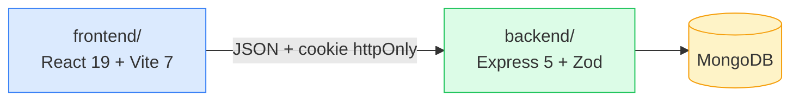

# Fullstack Source Base

Bộ khung (source base) tái sử dụng cho các dự án web fullstack: **Express 5 + MongoDB** ở backend,
**React 19 + TanStack Query** ở frontend.

Sẵn có: xác thực 3 phương thức, phân quyền RBAC 3 vai trò, kiến trúc module, xử lý lỗi tập trung,
phân trang/tìm kiếm/lọc/sắp xếp, và 322 test.



## Bắt đầu nhanh

```bash
npm install          # cài cho cả hai workspace
npm run env:sync     # tạo .env từ .env.example
# → điền DB_URI và hai khoá JWT trong backend/.env
#   node -e "console.log(require('crypto').randomBytes(48).toString('base64url'))"
npm run env:check    # kiểm tra .env đã đủ chưa
npm run seed         # tạo dữ liệu mẫu
npm run dev          # chạy backend + frontend
```

- Frontend: <http://localhost:5173>
- API: <http://localhost:8000/api/v1>
- Health check: <http://localhost:8000/api/v1/health>

Hướng dẫn chi tiết: [docs/01-tong-quan.md](./docs/01-tong-quan.md)

## Có sẵn những gì

| Nhóm           | Nội dung                                                                                                                                               |
| -------------- | ------------------------------------------------------------------------------------------------------------------------------------------------------ |
| **Xác thực**   | Email/mật khẩu · Google OAuth 2.0 · Magic link · JWT access + refresh · token rotation                                                                 |
| **Phân quyền** | RBAC 3 vai trò (`member` / `admin` / `superAdmin`) · 10 quyền chi tiết · 4 kiểu middleware                                                             |
| **Backend**    | ESM thuần · Zod validation · `BaseRepository` / `BaseService` · sinh CRUD tự động · xử lý lỗi tập trung · rate limit · graceful shutdown               |
| **Frontend**   | `createBrowserRouter` (file routes riêng) · `createCrudHooks` · `useTableQuery` (trạng thái trên URL) · tự làm mới token · Tailwind 4 · code-splitting |
| **Chất lượng** | 322 test · ESLint + Prettier dùng chung · script `npm run check`                                                                                       |
| **Tài liệu**   | 10 tài liệu tiếng Việt · 25+ sơ đồ Mermaid                                                                                                             |

## Cấu trúc

```
.
├── backend/     # API (Express 5 + MongoDB + Zod)
├── frontend/    # Web app (React 19 + Vite + TanStack Query)
├── docs/        # Tài liệu chi tiết bằng tiếng Việt
├── scripts/     # Script dùng chung
├── CLAUDE.md    # Hướng dẫn cho AI coding agent
└── CHECK_LIST.md # Theo dõi tiến độ
```

Nguyên tắc trung tâm: thứ gì **mọi dự án đều cần** nằm trong `core/`;
thứ gì **riêng dự án này** nằm trong `modules/` (backend) và `features/` (frontend).
Phụ thuộc chỉ đi một chiều: `modules → core`, không bao giờ ngược lại.

## Lệnh thường dùng

| Lệnh                 | Tác dụng                                     |
| -------------------- | -------------------------------------------- |
| `npm run dev`        | Chạy song song backend + frontend            |
| `npm test`           | Chạy toàn bộ test                            |
| `npm run check`      | format + lint + test (chạy trước khi commit) |
| `npm run seed`       | Tạo dữ liệu mẫu                              |
| `npm run env:check`  | Kiểm tra `.env` đồng bộ với `.env.example`   |
| `npm run kill:ports` | Tắt tiến trình chiếm cổng 8000 / 5173 / 4173 |

Danh sách đầy đủ: [docs/01-tong-quan.md](./docs/01-tong-quan.md#các-lệnh-thường-dùng)

## Tài liệu

| #   | Tài liệu                                                                    |
| --- | --------------------------------------------------------------------------- |
| 01  | [Tổng quan](./docs/01-tong-quan.md) — cài đặt, lệnh, luồng chạy             |
| 02  | [Kiến trúc](./docs/02-kien-truc.md) — sơ đồ, nguyên tắc `core` vs `modules` |
| 03  | [Backend](./docs/03-backend.md) — các tầng, thêm module mới                 |
| 04  | [Frontend](./docs/04-frontend.md) — custom hook, routing, token             |
| 05  | [Xác thực & Phân quyền](./docs/05-xac-thuc-phan-quyen.md)                   |
| 06  | [Biến môi trường](./docs/06-bien-moi-truong.md)                             |
| 07  | [Kiểm thử](./docs/07-kiem-thu.md)                                           |
| 08  | [Quy ước code](./docs/08-quy-uoc-code.md)                                   |
| 09  | [Lộ trình](./docs/09-lo-trinh.md) — Phase 2–6                               |

## Dùng cho dự án mới

1. Sao chép repo, xoá lịch sử git (`rm -rf .git && git init`)
2. Xoá module mẫu: `backend/src/modules/product/` và `frontend/src/features/products/`
3. Gỡ chúng khỏi `modules/index.js`, `queryKeys.js`, `paths.js`, `routes/index.jsx`
4. Giữ nguyên toàn bộ `core/` của hai bên
5. Thêm module nghiệp vụ theo hướng dẫn ở [docs/03-backend.md](./docs/03-backend.md)

## Yêu cầu

Node.js ≥ 20.11 (khuyến nghị 22) · npm ≥ 10 · MongoDB (cục bộ hoặc Atlas)
