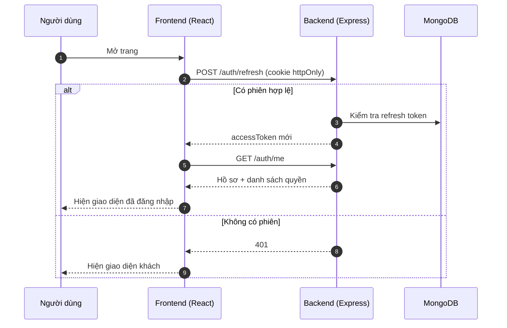

# 01 — Tổng quan

## Source base này là gì?

Đây là **bộ khung khởi đầu (source base)** cho các dự án web fullstack. Thay vì mỗi dự án mới lại
viết lại đăng nhập, phân quyền, phân trang, xử lý lỗi từ đầu, bạn sao chép repo này và bắt tay
ngay vào phần nghiệp vụ riêng.

Nguyên tắc trung tâm:

> Thứ gì **mọi dự án đều cần** thì nằm trong `core/`.
> Thứ gì **riêng của dự án này** thì nằm trong `modules/` (backend) và `features/` (frontend).

Khi bắt đầu dự án mới: xoá module mẫu (`product`), giữ nguyên `core/`.

## Công nghệ sử dụng

### Backend

| Thành phần    | Lựa chọn                                   | Lý do                                            |
| ------------- | ------------------------------------------ | ------------------------------------------------ |
| Runtime       | Node.js ≥ 20.11, **ESM thuần**             | `import/export` chuẩn, không dùng `require`      |
| Web framework | Express 5                                  | Tự bắt lỗi từ `async` handler, API ổn định       |
| Cơ sở dữ liệu | MongoDB + Mongoose 8                       | Schema linh hoạt, hợp với giai đoạn đầu dự án    |
| Validation    | **Zod 4**                                  | Một schema dùng được cho cả validate lẫn ép kiểu |
| Xác thực      | JWT (access + refresh)                     | Không trạng thái, dễ mở rộng ngang               |
| Mật khẩu      | bcrypt                                     | Chuẩn công nghiệp, có salt sẵn                   |
| Test          | Vitest + Supertest + mongodb-memory-server | Không cần DB thật khi chạy test                  |

### Frontend

| Thành phần   | Lựa chọn                               | Lý do                                          |
| ------------ | -------------------------------------- | ---------------------------------------------- |
| UI           | React 19                               | Hệ sinh thái lớn nhất                          |
| Build        | Vite 7                                 | Khởi động tức thì, build nhanh                 |
| Định tuyến   | React Router 7 (`createBrowserRouter`) | Cấu hình dạng dữ liệu, tách khỏi giao diện     |
| Server state | TanStack Query 5                       | Cache, đồng bộ, retry — tự động                |
| Form         | React Hook Form + Zod                  | Ít render lại, validate dùng chung với backend |
| HTTP         | Axios                                  | Interceptor để tự động làm mới token           |
| CSS          | Tailwind CSS 4                         | Không phải đặt tên class, không có CSS chết    |
| Test         | Vitest + Testing Library               | Test theo góc nhìn người dùng                  |

## Cấu trúc thư mục gốc

```
.
├── backend/          # API server (Express + MongoDB)
├── frontend/         # Ứng dụng web (React + Vite)
├── docs/             # Tài liệu (bạn đang ở đây)
├── scripts/          # Script dùng chung cho cả dự án
├── package.json      # npm workspaces + script gốc
├── eslint.config.js  # Cấu hình lint dùng chung
├── .prettierrc       # Định dạng code dùng chung
├── CLAUDE.md         # Hướng dẫn cho AI coding agent
└── CHECK_LIST.md     # Theo dõi tiến độ công việc
```

Dự án dùng **npm workspaces**: chạy `npm install` một lần ở thư mục gốc là cài cho cả hai bên.

## Cài đặt lần đầu

### Yêu cầu

- Node.js ≥ 20.11 (khuyến nghị 22, xem `.nvmrc`)
- npm ≥ 10
- MongoDB — chạy cục bộ hoặc dùng MongoDB Atlas (miễn phí)

### Các bước

```bash
# 1. Cài dependencies cho toàn bộ workspace
npm install

# 2. Tạo file .env từ .env.example (không ghi đè giá trị đang có)
npm run env:sync

# 3. Sinh khoá bí mật JWT ngẫu nhiên và dán vào backend/.env
node -e "console.log(require('crypto').randomBytes(48).toString('base64url'))"

# 4. Điền DB_URI trong backend/.env
#    Cục bộ: mongodb://127.0.0.1:27017/source_base

# 5. Kiểm tra .env đã đồng bộ với .env.example chưa
npm run env:check

# 6. Tạo dữ liệu mẫu (3 tài khoản + 5 sản phẩm)
npm run seed

# 7. Chạy cả backend và frontend cùng lúc
npm run dev
```

Sau bước 7:

- Backend: <http://localhost:8000/api/v1>
- Frontend: <http://localhost:5173>
- Health check: <http://localhost:8000/api/v1/health>

### Tài khoản mẫu sau khi seed

| Email                    | Mật khẩu         | Vai trò    |
| ------------------------ | ---------------- | ---------- |
| `superadmin@example.com` | `SuperAdmin@123` | superAdmin |
| `admin@example.com`      | `Admin@12345`    | admin      |
| `member@example.com`     | `Member@12345`   | member     |

> ⚠️ Đây là tài khoản **chỉ dùng khi phát triển**. Trước khi lên production phải đổi
> `SEED_SUPER_ADMIN_PASSWORD` và xoá hai tài khoản còn lại.

## Các lệnh thường dùng

Tất cả chạy từ **thư mục gốc**:

| Lệnh                                  | Tác dụng                                             |
| ------------------------------------- | ---------------------------------------------------- |
| `npm run dev`                         | Chạy song song backend + frontend                    |
| `npm run dev:be` / `npm run dev:fe`   | Chạy riêng từng bên                                  |
| `npm run build`                       | Build frontend cho production                        |
| `npm start`                           | Chạy backend ở chế độ production                     |
| `npm test`                            | Chạy toàn bộ test (backend + frontend)               |
| `npm run test:be` / `npm run test:fe` | Test riêng từng bên                                  |
| `npm run test:cov`                    | Test kèm báo cáo độ phủ (coverage)                   |
| `npm run lint` / `npm run lint:fix`   | Kiểm tra / tự sửa lỗi lint                           |
| `npm run format`                      | Định dạng lại toàn bộ code bằng Prettier             |
| `npm run check`                       | Chạy đủ format + lint + test (dùng trước khi commit) |
| `npm run seed`                        | Tạo dữ liệu mẫu                                      |
| `npm run env:sync`                    | Tạo/bổ sung `.env` từ `.env.example`                 |
| `npm run env:check`                   | Báo lỗi nếu `.env` lệch với `.env.example`           |
| `npm run kill:ports`                  | Tắt tiến trình đang chiếm cổng 8000 / 5173 / 4173    |
| `npm run clean`                       | Xoá `node_modules`, `dist`, `coverage`               |

## Luồng chạy tổng quát


