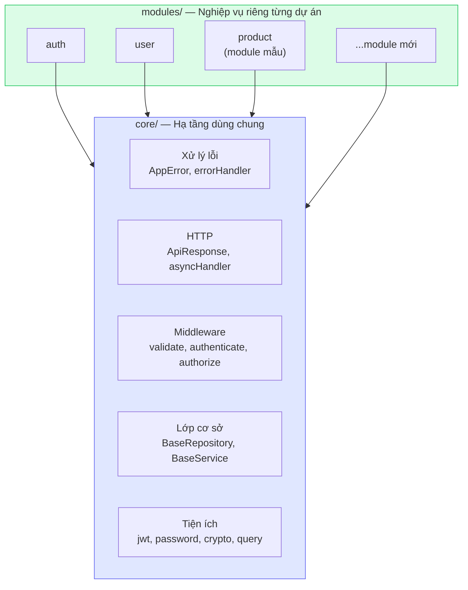
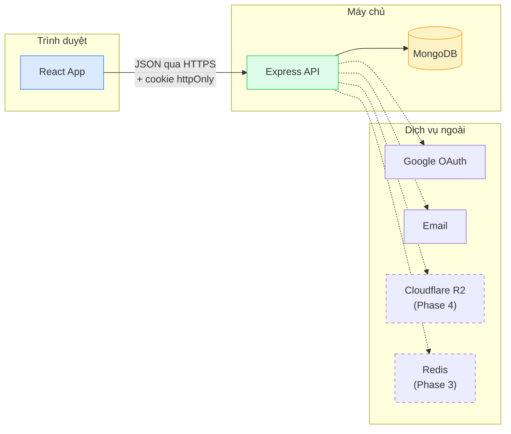
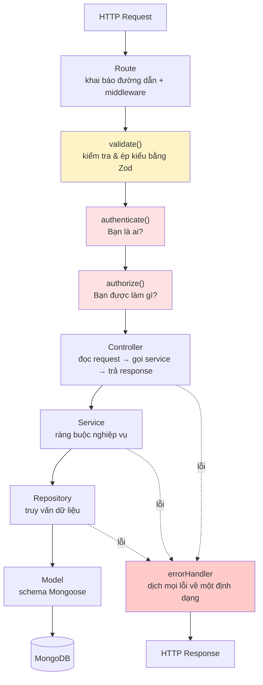
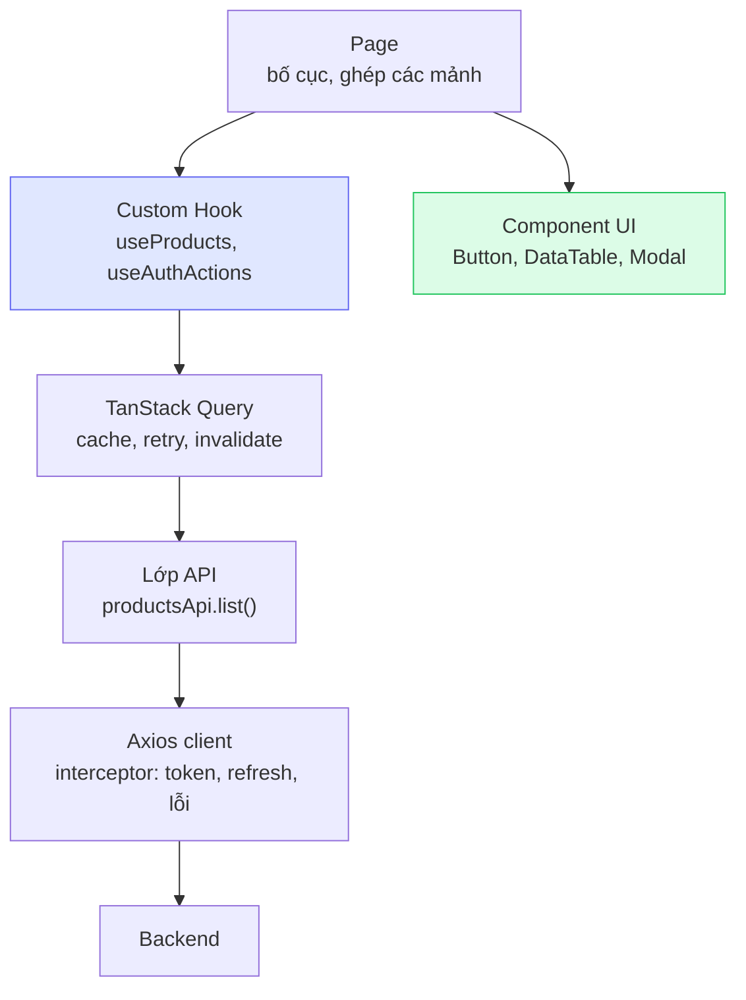

# 02 — Kiến trúc

## Nguyên tắc cốt lõi: `core` và `modules`

Đây là quyết định quan trọng nhất của source base. Mọi thứ khác đều xuất phát từ đây.



**Quy tắc phụ thuộc — chỉ có một chiều duy nhất:**

| Được phép                                    | Bị cấm                                         |
| -------------------------------------------- | ---------------------------------------------- |
| `modules/*` → `core/*`                       | `core/*` → `modules/*`                         |
| `modules/product` → `core/db/BaseRepository` | `modules/product` → `modules/user` (trực tiếp) |

Vì sao cấm chiều ngược lại? Nếu `core` biết đến `product`, thì mang `core` sang dự án khác
sẽ kéo theo cả code sản phẩm không liên quan. Giữ chiều một hướng thì `core` luôn "sạch"
và sao chép sang dự án mới được ngay.

> Module cần dùng nhau thì gọi qua **service**, không gọi thẳng vào model của nhau.
> Ví dụ `auth.service.js` dùng `userService`, không đụng trực tiếp vào `User` model.

## Kiến trúc tổng thể



Đường nét đứt = tính năng của các phase sau (xem [09 — Lộ trình](./09-lo-trinh.md)).

## Backend: các tầng (layers)

Một request đi qua đúng các tầng sau, mỗi tầng **một trách nhiệm duy nhất**:



### Vì sao tách nhiều tầng như vậy?

| Tầng           | Trách nhiệm                                         | Biết gì về Express? |
| -------------- | --------------------------------------------------- | ------------------- |
| **Route**      | Khai báo `METHOD /đường-dẫn` + xâu chuỗi middleware | Có                  |
| **Controller** | Đọc `req`, gọi service, gọi `ApiResponse`           | Có                  |
| **Service**    | Ràng buộc nghiệp vụ, ném `AppError`                 | **Không**           |
| **Repository** | Truy vấn MongoDB                                    | **Không**           |
| **Model**      | Định nghĩa schema, hook, index                      | **Không**           |

Service không biết gì về `req`/`res` nên **test được trực tiếp** — không cần dựng HTTP server.
Đây là lý do `auth.service.js` có thể kiểm thử đầy đủ luồng Google OAuth mà không gọi Google thật.

## Frontend: các tầng



**Nguyên tắc: trang (page) không được gọi `axios` trực tiếp.**

Trang chỉ gọi custom hook. Hook gọi lớp API. Lớp API gọi axios client.
Nhờ chuỗi này, đổi thư viện HTTP hay đổi cách cache chỉ phải sửa một tầng.

## Định dạng response thống nhất

**Mọi** endpoint đều trả về cùng một hình dạng. Frontend nhờ đó chỉ cần một lớp xử lý duy nhất.

### Thành công

```json
{
  "success": true,
  "message": "Lấy danh sách sản phẩm thành công",
  "data": [{ "id": "...", "title": "..." }],
  "meta": {
    "pagination": {
      "total": 42,
      "page": 1,
      "limit": 10,
      "totalPages": 5,
      "hasPrevPage": false,
      "hasNextPage": true
    }
  }
}
```

`meta` chỉ xuất hiện khi có phân trang.

### Thất bại

```json
{
  "success": false,
  "message": "Dữ liệu gửi lên không hợp lệ",
  "errorCode": "VALIDATION_ERROR",
  "details": [{ "field": "body.email", "message": "Email không hợp lệ", "location": "body" }]
}
```

| Trường      | Mục đích                                                     |
| ----------- | ------------------------------------------------------------ |
| `message`   | Câu hiển thị cho người dùng cuối                             |
| `errorCode` | Mã ổn định để code xử lý theo nhánh (và để dịch đa ngôn ngữ) |
| `details`   | Chi tiết từng trường — frontend gắn thẳng vào form           |

Vì sao cần **cả** HTTP status lẫn `errorCode`? HTTP status nói _loại_ lỗi (401 = chưa xác thực),
`errorCode` nói _chính xác_ lỗi gì (`TOKEN_EXPIRED` khác `INVALID_CREDENTIALS` — token hết hạn thì
thử làm mới, sai mật khẩu thì báo người dùng).

## Bản đồ thư mục

```
backend/src/
├── index.js                 # Khởi động server, graceful shutdown
├── app.js                   # Tạo Express app (app factory)
├── config/
│   ├── env.js               # Validate biến môi trường bằng Zod — fail-fast
│   └── database.js          # Kết nối MongoDB
├── core/                    # ⭐ HẠ TẦNG DÙNG CHUNG
│   ├── constants/           # roles, permissions, httpStatus, auth
│   ├── errors/              # AppError + mã lỗi nghiệp vụ
│   ├── http/                # ApiResponse, asyncHandler
│   ├── middlewares/         # validate, authenticate, authorize, errorHandler...
│   ├── db/                  # BaseRepository + plugin Mongoose
│   ├── service/             # BaseService
│   ├── controller/          # createCrudController (sinh CRUD tự động)
│   ├── utils/               # jwt, password, crypto, queryFeatures, time, slug
│   └── validation/          # Schema Zod dùng chung
├── modules/                 # ⭐ NGHIỆP VỤ
│   ├── index.js             # Đăng ký module — nơi DUY NHẤT cần sửa khi thêm module
│   ├── auth/                # Xác thực: 3 phương thức đăng nhập
│   ├── user/                # Người dùng + phân quyền
│   └── product/             # MODULE MẪU — dùng làm khuôn
├── routes/index.js          # Router gốc + health check
├── shared/services/         # Dịch vụ dùng chung (mail...)
└── seeds/                   # Dữ liệu khởi tạo

frontend/src/
├── main.jsx                 # Điểm vào
├── App.jsx                  # Lắp các Provider
├── routes/index.jsx         # ⭐ TOÀN BỘ định tuyến (createBrowserRouter)
├── core/                    # ⭐ HẠ TẦNG DÙNG CHUNG
│   ├── config/              # env, constants
│   ├── api/                 # axios client + chuẩn hoá lỗi
│   ├── auth/                # AuthProvider, useAuth, tokenStorage
│   ├── components/ui/       # Button, DataTable, Modal, Pagination...
│   ├── hooks/               # createCrudHooks, useTableQuery, useDebounce...
│   ├── query/               # queryClient, queryKeys
│   ├── router/              # paths, guards
│   └── utils/               # format
├── features/                # ⭐ NGHIỆP VỤ
│   ├── auth/                # api, schemas, hook, pages, components
│   ├── products/            # MODULE MẪU
│   └── users/
├── layouts/                 # MainLayout, AdminLayout, AuthLayout
└── pages/                   # Trang tĩnh: Home, About, 404, 403, Error
```
