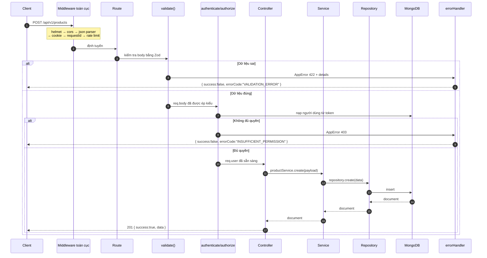
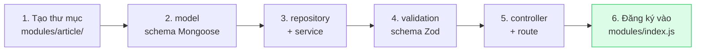
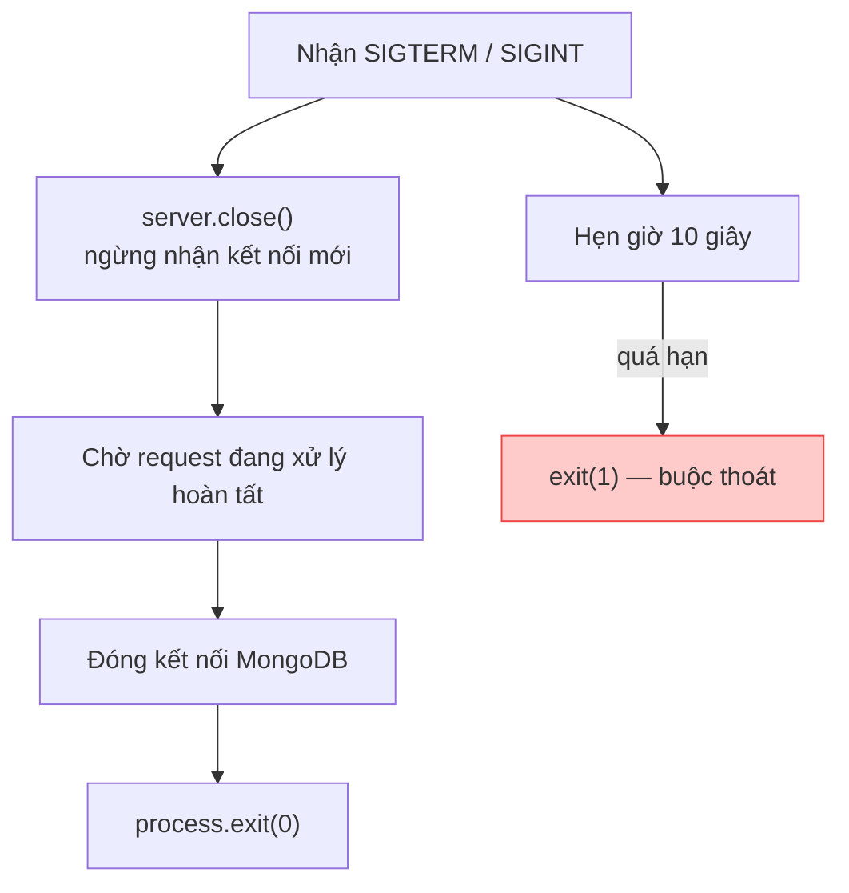

# 03 — Backend

## Vòng đời một request



## Các thành phần trong `core/`

### `AppError` — lỗi có chủ đích

Phân biệt hai loại lỗi:

- **Operational** (`isOperational: true`): lỗi đã lường trước — 404, 400, 403. Trả thẳng cho client.
- **Programmer error** (`isOperational: false`): bug. Client chỉ thấy "Đã có lỗi xảy ra", chi tiết chỉ vào log.

```js
import { AppError } from "../../core/errors/index.js";

throw AppError.notFound("Sản phẩm không tồn tại");
throw AppError.conflict("Email đã được sử dụng", ERROR_CODES.EMAIL_ALREADY_EXISTS);
throw AppError.forbidden("Bạn không có quyền xoá bản ghi này");
throw AppError.validation("Dữ liệu không hợp lệ", [{ field: "email", message: "..." }]);
```

### `asyncHandler` — không cần `try/catch`

```js
// ❌ Cách cũ — lặp lại ở mọi controller
export const getAll = async (req, res) => {
  try {
    const items = await Product.find();
    res.json({ data: items });
  } catch (error) {
    res.status(500).json({ message: "Lỗi", error });
  }
};

// ✅ Cách hiện tại — mọi lỗi tự động đi vào errorHandler
export const getAll = asyncHandler(async (req, res) => {
  const result = await productService.list(req.query);
  return ApiResponse.paginated(res, result);
});
```

> **Chi tiết dễ bỏ sót:** `asyncHandler` bọc lời gọi trong `try/catch` _bên ngoài_ `Promise.resolve`.
> Nếu chỉ viết `Promise.resolve(handler(...)).catch(next)` thì lỗi ném **đồng bộ** (trước khi hàm
> trả về Promise) sẽ thoát ra ngoài mà không ai bắt. Xem `core/http/asyncHandler.js`.

### `validate()` — kiểm tra bằng Zod

```js
router.post(
  "/",
  validate({ body: createProductSchema, params: idParamSchema, query: listQuerySchema }),
  productController.create,
);
```

Ba điểm quan trọng:

1. **Ép kiểu**: `"100"` trong body thành `100` trong `req.body` — controller nhận dữ liệu đã sạch.
2. **Gom lỗi**: mọi lỗi của mọi phần (body + params + query) được gom vào **một** response 422.
3. **Express 5**: `req.query` là getter chỉ đọc, nên middleware ghi đè bằng `Object.defineProperty`
   và đồng thời lưu vào `req.validatedQuery`.

### `BaseRepository` — tầng truy cập dữ liệu

```js
// Không có truy vấn riêng → dùng luôn
export const productRepository = new BaseRepository(Product);

// Có truy vấn riêng → kế thừa
export class UserRepository extends BaseRepository {
  findByEmail(email, { withPassword = false } = {}) {
    const query = this.model.findOne({ email: email.toLowerCase().trim() });
    if (withPassword) query.select("+password");
    return query.exec();
  }
}
```

`paginate()` chạy **đếm tổng và lấy danh sách song song** bằng `Promise.all` — giảm một nửa độ trễ
so với chạy tuần tự.

### `BaseService` — nghiệp vụ

```js
export class ProductService extends BaseService {
  constructor(repository = productRepository) {
    super(repository, {
      resourceName: "Sản phẩm",
      searchableFields: ["title", "description"], // cho phép tìm kiếm
      filterableFields: ["price", "isActive"], // cho phép lọc
      sortableFields: ["createdAt", "price"], // cho phép sắp xếp
    });
  }
}
```

> **Vì sao phải khai báo danh sách field cho phép?**
> Nếu nhận bừa mọi tham số từ query string, người dùng có thể gửi `?password=...` để lọc theo
> mật khẩu, hoặc `?sort=password` để dò dữ liệu nhạy cảm. Danh sách trắng (allowlist) chặn việc này.

### `createCrudController` — sinh CRUD tự động

```js
const crud = createCrudController(productService, {
  resourceName: "sản phẩm",
  buildCreatePayload: (req) => ({ createdBy: req.user?.id }),
});

export const productController = {
  ...crud,                      // list, getById, create, update, remove
  listPublic: asyncHandler(...) // chỉ viết tay phần thực sự khác biệt
};
```

## Thêm module mới — 6 bước

Ví dụ: thêm module `article` (bài viết).



### Bước 1–2: Model

```js
// modules/article/article.model.js
import mongoose from "mongoose";
import { toJSONPlugin } from "../../core/db/plugins/toJSON.js";

const articleSchema = new mongoose.Schema(
  {
    title: { type: String, required: true, trim: true },
    content: { type: String, required: true },
    author: { type: mongoose.Schema.Types.ObjectId, ref: "User", required: true },
    isPublished: { type: Boolean, default: false, index: true },
  },
  { timestamps: true, versionKey: false },
);

articleSchema.plugin(toJSONPlugin); // _id → id, xoá __v, ẩn field private

export const Article = mongoose.models.Article || mongoose.model("Article", articleSchema);
```

### Bước 3: Repository + Service

```js
// modules/article/article.repository.js
import { BaseRepository } from "../../core/db/BaseRepository.js";
import { Article } from "./article.model.js";

export const articleRepository = new BaseRepository(Article);
```

```js
// modules/article/article.service.js
import { BaseService } from "../../core/service/BaseService.js";
import { articleRepository } from "./article.repository.js";

export class ArticleService extends BaseService {
  constructor(repository = articleRepository) {
    super(repository, {
      resourceName: "Bài viết",
      searchableFields: ["title", "content"],
      filterableFields: ["isPublished", "author"],
      sortableFields: ["createdAt", "title"],
    });
  }
}

export const articleService = new ArticleService();
```

### Bước 4: Validation

```js
// modules/article/article.validation.js
import { z } from "zod";
import { createListQuerySchema, idParamSchema } from "../../core/validation/common.js";

export const articleIdParamSchema = idParamSchema;

export const listArticlesQuerySchema = createListQuerySchema({
  isPublished: z.enum(["true", "false"]).optional(),
});

export const createArticleSchema = z.object({
  title: z.string().trim().min(5).max(200),
  content: z.string().trim().min(20),
  isPublished: z.boolean().optional().default(false),
});

export const updateArticleSchema = createArticleSchema
  .partial()
  .refine((data) => Object.keys(data).length > 0, {
    message: "Cần ít nhất một trường để cập nhật",
  });
```

### Bước 5: Controller + Route

```js
// modules/article/article.controller.js
import { createCrudController } from "../../core/controller/createCrudController.js";
import { articleService } from "./article.service.js";

export const articleController = createCrudController(articleService, {
  resourceName: "bài viết",
  buildCreatePayload: (req) => ({ author: req.user.id }),
});
```

```js
// modules/article/article.route.js
import { Router } from "express";
import { validate } from "../../core/middlewares/validate.js";
import { requirePermission } from "../../core/middlewares/authorize.js";
import { requireAuth } from "../auth/auth.middleware.js";
import { articleController } from "./article.controller.js";
import * as schemas from "./article.validation.js";

const router = Router();
router.use(requireAuth);

router.get("/", validate({ query: schemas.listArticlesQuerySchema }), articleController.list);
router.post(
  "/",
  requirePermission("article:create"),
  validate({ body: schemas.createArticleSchema }),
  articleController.create,
);
// ... getById / update / remove tương tự

export default router;
```

### Bước 6: Đăng ký

```js
// modules/index.js — file DUY NHẤT phải sửa
import articleRouter from "./article/article.route.js";

export const moduleRoutes = [
  // ...các module cũ
  { path: "/articles", router: articleRouter, description: "Quản lý bài viết" },
];
```

Thêm quyền mới vào `core/constants/roles.js`:

```js
export const PERMISSIONS = Object.freeze({
  // ...
  ARTICLE_READ: "article:read",
  ARTICLE_CREATE: "article:create",
});

const ADMIN_PERMISSIONS = [
  // ...
  PERMISSIONS.ARTICLE_CREATE,
];
```

Xong. Module mới có ngay: phân trang, tìm kiếm, lọc, sắp xếp, validate, phân quyền, xử lý lỗi.

## Tắt máy an toàn (graceful shutdown)



Không có bước này thì khi deploy, các request đang xử lý dở sẽ bị cắt ngang giữa chừng.

## Lưu ý khi triển khai production

| Việc cần làm                                       | Vì sao                                                  |
| -------------------------------------------------- | ------------------------------------------------------- |
| Đặt `NODE_ENV=production`                          | Ẩn chi tiết lỗi 500, bật cookie `secure`, log dạng JSON |
| Dùng khoá JWT khác nhau cho access và refresh      | App sẽ từ chối khởi động nếu trùng                      |
| Cấu hình `CORS_ORIGINS` đúng domain thật           | Mặc định chỉ cho localhost                              |
| Bật `trust proxy` (đã tự bật khi production)       | Để rate limit đọc đúng IP sau Nginx/Cloudflare          |
| Chuyển rate limit sang store Redis                 | Store trong RAM không dùng được khi chạy nhiều instance |
| Đặt `CRON_ENABLED=true` trên **đúng một** instance | Tránh chạy trùng tác vụ định kỳ                         |
