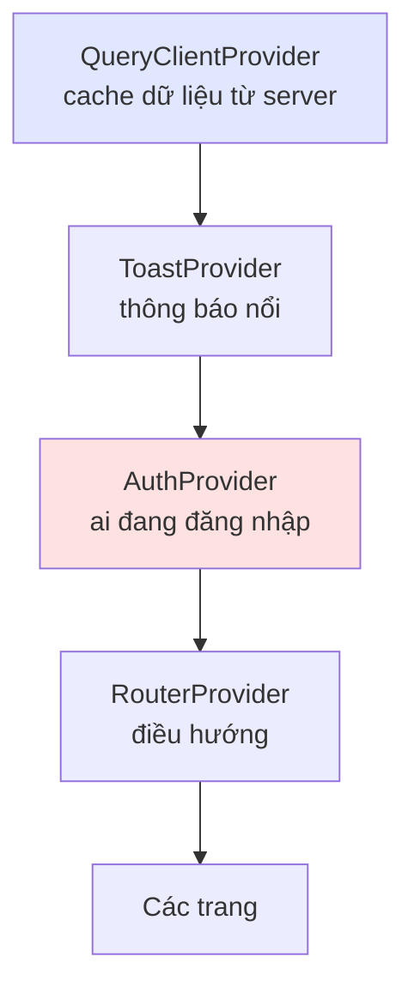
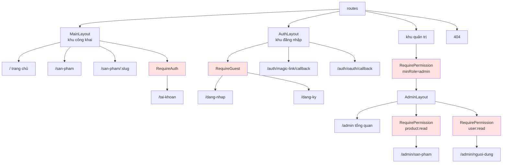
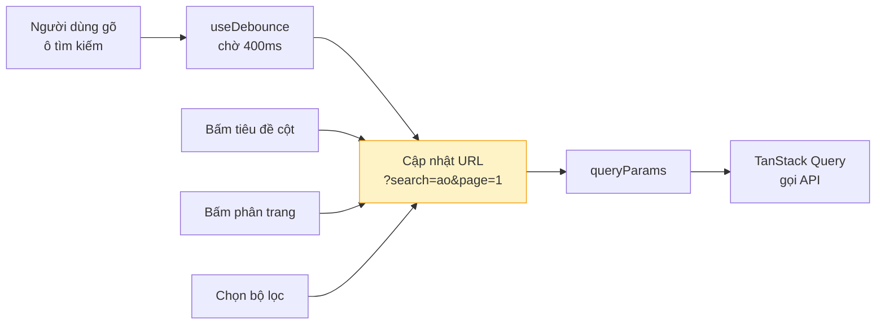
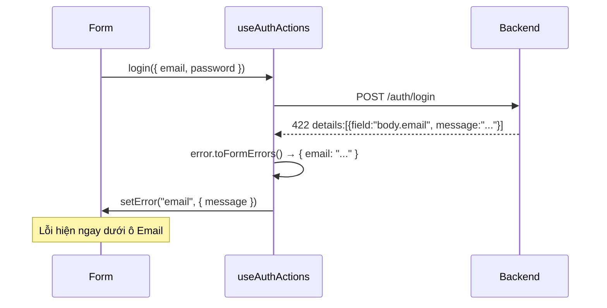
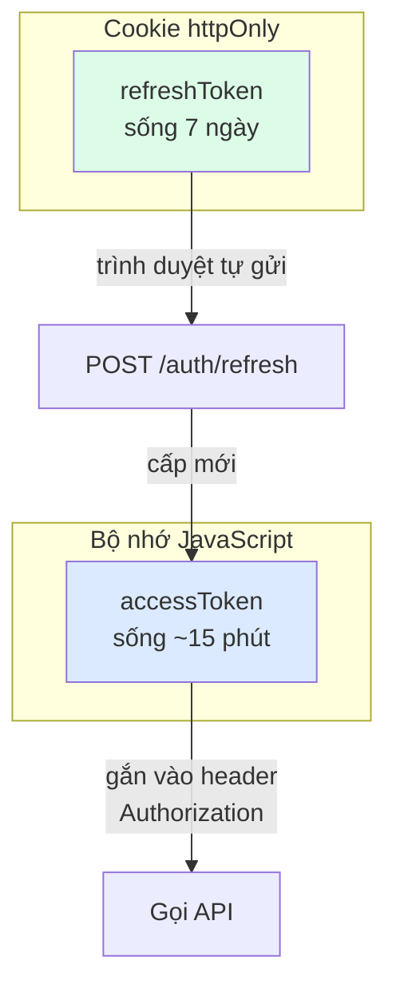
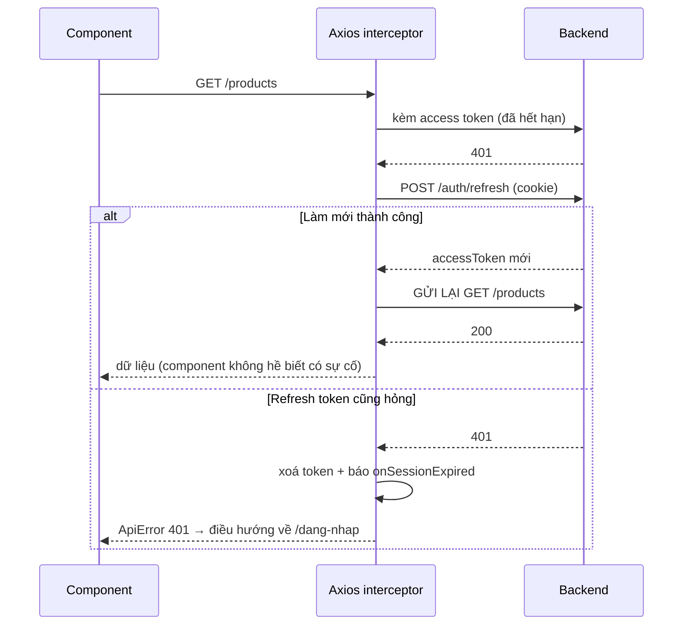

# 04 — Frontend

## Cây Provider



Thứ tự **không thể đổi**: `AuthProvider` dùng cache của Query và dùng toast để báo lỗi;
router cần biết trạng thái đăng nhập để chặn đường.

## Định tuyến — `createBrowserRouter`

Toàn bộ sơ đồ đường đi nằm ở **một file**: `src/routes/index.jsx`.

### Vì sao không dùng `<Routes>` lồng trong JSX?

| `createBrowserRouter` (đang dùng)                         | `<Routes>` trong JSX         |
| --------------------------------------------------------- | ---------------------------- |
| Cấu hình là **dữ liệu** — sinh menu, test, phân tích được | Là JSX — khó xử lý bằng code |
| Dùng được `loader`, `action`, `errorElement`              | Không                        |
| Định tuyến tách hẳn khỏi giao diện                        | Trộn lẫn                     |

### Cấu trúc phân tầng



> **Chi tiết dễ sai:** hai trang callback (`magic-link`, `oauth`) **không** được bọc `RequireGuest`.
> Chúng chạy đúng lúc phiên đang được thiết lập; chặn lại sẽ làm hỏng luồng đăng nhập.

### Đường dẫn tập trung

Mọi đường dẫn khai báo ở `core/router/paths.js`:

```js
import { PATHS, buildPath } from "@/core/router/paths.js";

<Link to={PATHS.PRODUCTS}>Sản phẩm</Link>
<Link to={buildPath(PATHS.PRODUCT_DETAIL, { slug: product.slug })}>Chi tiết</Link>
```

Đổi `/san-pham` thành `/products`? Sửa **một dòng**.

### Tải lười (lazy loading)

Các trang nặng dùng `lazy()` + `Suspense`. Người dùng không vào `/admin` thì không phải tải code
khu quản trị. Kết quả build cho thấy `ProductManagementPage` tách thành chunk riêng ~7 kB.

## Custom hook — trái tim của việc tái sử dụng

### `createCrudHooks` — sinh 5 hook từ một lớp API

```js
// features/products/useProducts.js — TOÀN BỘ file quan trọng chỉ có thế này
const productHooks = createCrudHooks({
  api: productsApi,
  keys: queryKeys.products,
  resourceName: "sản phẩm",
});

export const {
  useList: useProducts,
  useDetail: useProduct,
  useCreate: useCreateProduct,
  useUpdate: useUpdateProduct,
  useRemove: useDeleteProduct,
} = productHooks;
```

Đã xử lý sẵn bên trong:

- Bóc tách `data` và `meta.pagination` khỏi response.
- `placeholderData` giữ dữ liệu trang cũ khi chuyển trang → bảng không "nhảy".
- Tự `invalidateQueries` danh sách sau mỗi lần tạo/sửa/xoá.
- Ghi thẳng bản mới vào cache chi tiết sau khi cập nhật.
- Không retry với lỗi 4xx (sai dữ liệu thì thử lại vô ích).

### `useTableQuery` — trạng thái bảng nằm trên URL

```js
const table = useTableQuery({ defaultSort: "-createdAt" });
const { items, pagination, isLoading } = useProducts(table.queryParams);
```



Vì sao lưu trên URL thay vì `useState`?

- F5 không mất bộ lọc đang xem.
- Gửi link cho đồng nghiệp, họ thấy đúng kết quả đó.
- Nút Back/Forward của trình duyệt hoạt động đúng.

> Đổi bộ lọc thì `page` tự về 1 — nếu không, người dùng đang ở trang 5 mà lọc lại sẽ thấy trang trắng.

### `useAuthActions` — gom cả 4 luồng đăng nhập

Cả 4 luồng (đăng ký, mật khẩu, Google, magic link) đều kết thúc giống hệt nhau:
lưu phiên → xoá cache cũ → báo thành công → điều hướng về trang trước đó.
Gom vào một hook để logic này chỉ tồn tại ở một nơi.

Hook còn tự dịch lỗi validate của backend sang `setError` của React Hook Form:



## Xử lý token



|                      | Access token             | Refresh token     |
| -------------------- | ------------------------ | ----------------- |
| Lưu ở                | Biến JavaScript (bộ nhớ) | Cookie `httpOnly` |
| JavaScript đọc được? | Có                       | **Không**         |
| Mất khi F5?          | Có                       | Không             |
| Thời gian sống       | 15 phút                  | 7 ngày            |

**Vì sao không dùng `localStorage`?** `localStorage` bị mọi script trong trang đọc được — một lỗ
hổng XSS là mất token. Giữ trong biến thì token biến mất khi F5, nhưng refresh token trong cookie
`httpOnly` sẽ tự cấp lại (xem `AuthProvider.restoreSession`). Đổi lại: an toàn hơn hẳn.

### Tự động làm mới khi gặp 401



Hai chi tiết chống lỗi:

1. **Chỉ gọi refresh một lần** dù nhiều request cùng bị 401 — nhờ biến `refreshPromise` dùng chung.
2. **`NO_RETRY_PATHS`** loại `/auth/login`, `/auth/refresh`… khỏi cơ chế này, tránh lặp vô tận.

## Component UI dùng chung

| Component                     | Dùng khi                                                                     |
| ----------------------------- | ---------------------------------------------------------------------------- |
| `Button`                      | Có sẵn trạng thái loading, tự disable khi đang gửi                           |
| `FormField` / `TextAreaField` | `forwardRef` để React Hook Form dùng được; có `aria-invalid`, `role="alert"` |
| `DataTable`                   | Khai báo cột → có ngay bảng + trạng thái loading/rỗng/lỗi + sắp xếp          |
| `Pagination`                  | Nhận thẳng `meta.pagination` từ backend                                      |
| `Modal`                       | Đóng bằng Esc, khoá cuộn trang nền                                           |
| `Alert`                       | Thông báo tĩnh trong trang                                                   |
| `Spinner` / `FullPageSpinner` | Có nhãn cho trình đọc màn hình                                               |

### Ví dụ `DataTable` — khai báo, không lập trình

```jsx
const columns = [
  { key: "title", header: "Tên sản phẩm", sortable: true },
  { key: "price", header: "Giá", sortable: true, render: (row) => formatCurrency(row.price) },
  { key: "actions", header: "Thao tác", render: (row) => <Button onClick={...}>Sửa</Button> },
];

<DataTable
  columns={columns}
  rows={items}
  isLoading={isLoading}
  error={error}
  onSort={table.toggleSort}
  getSortDirection={table.getSortDirection}
/>
```

## Thêm feature mới — 5 bước

```
features/article/
├── article.api.js       # 1. list/getById/create/update/remove
├── article.schemas.js   # 2. schema Zod cho form
├── useArticles.js       # 3. createCrudHooks(...)
├── components/          # 4. ArticleForm.jsx
└── pages/               # 5. ArticleManagementPage.jsx
```

Rồi thêm query key vào `core/query/queryKeys.js`, thêm đường dẫn vào `core/router/paths.js`,
và khai báo route trong `routes/index.jsx`.

## Quy ước quan trọng

| Quy ước                                                             | Lý do                                                                   |
| ------------------------------------------------------------------- | ----------------------------------------------------------------------- |
| Trang **không** gọi `axios` trực tiếp                               | Đổi thư viện HTTP chỉ sửa một tầng                                      |
| Mỗi feature lớn có **một** custom hook                              | Logic tập trung, test được, dùng lại được                               |
| Context tách khỏi component (`AuthContext.js` ≠ `AuthProvider.jsx`) | Fast Refresh của Vite mới giữ được state khi sửa code                   |
| Feature flag (`VITE_ENABLE_*`) phải khớp cấu hình backend           | Tránh hiện nút bấm vào là lỗi                                           |
| Kiểm tra quyền ở frontend **chỉ để hiển thị**                       | Người dùng sửa được biến trong DevTools — backend mới là nơi quyết định |
