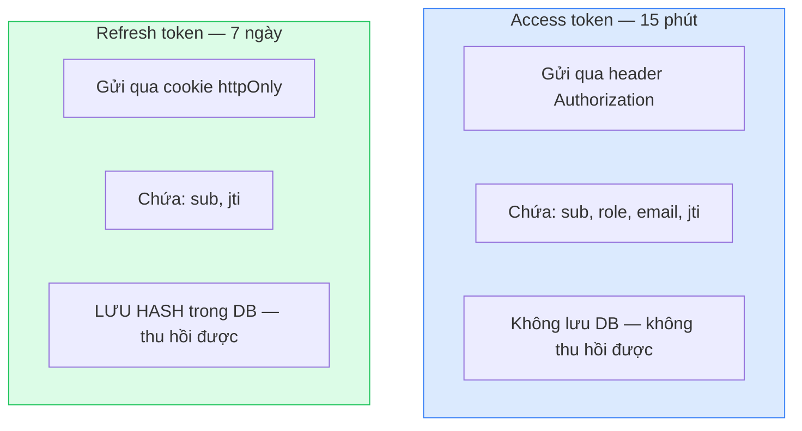
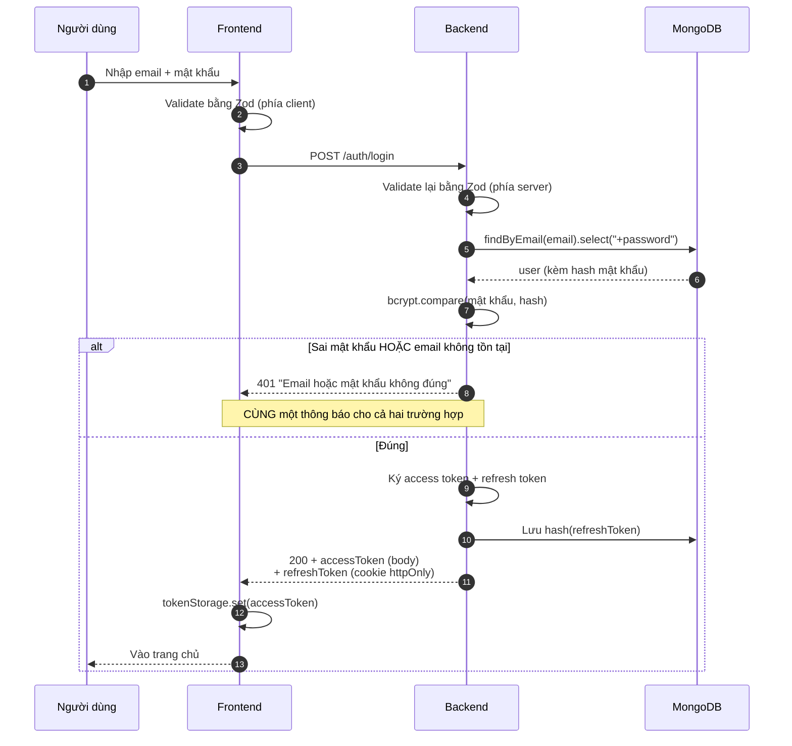
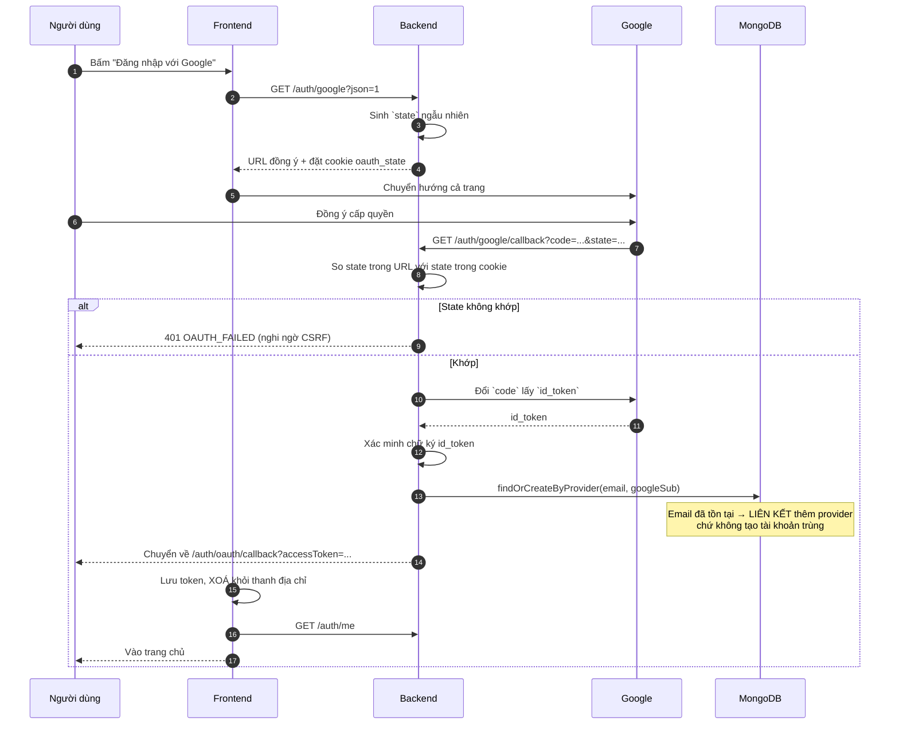
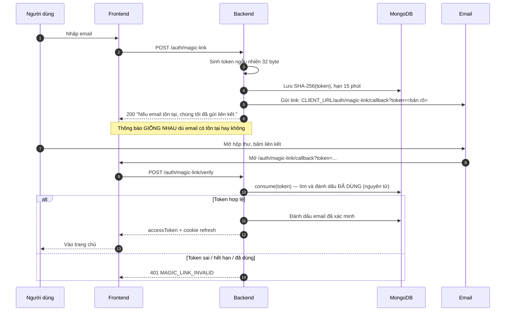
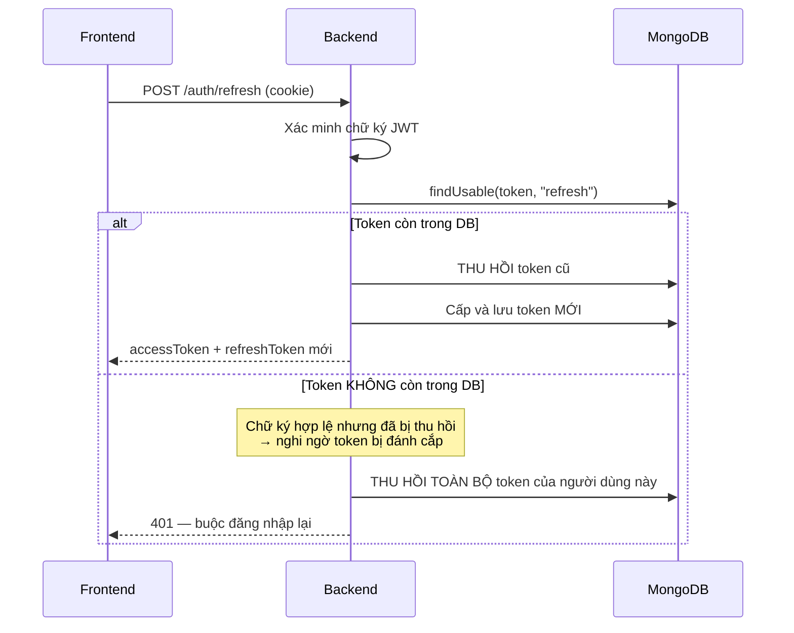
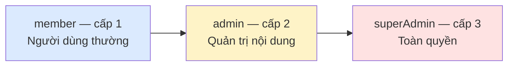
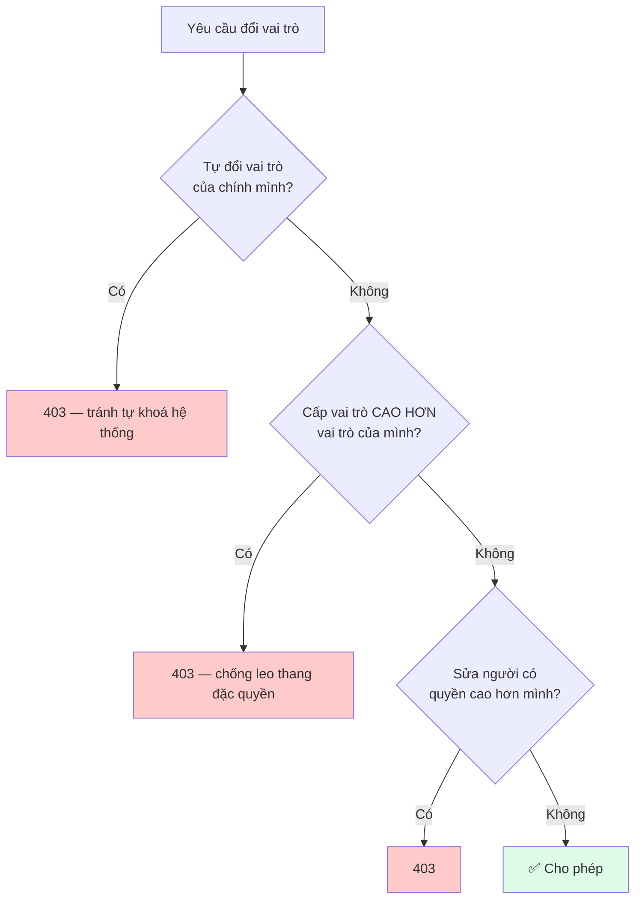

# 05 — Xác thực & Phân quyền

Hai khái niệm dễ nhầm:

|                | Câu hỏi              | Tiếng Anh      | Nơi xử lý                          |
| -------------- | -------------------- | -------------- | ---------------------------------- |
| **Xác thực**   | Bạn **là ai**?       | Authentication | `core/middlewares/authenticate.js` |
| **Phân quyền** | Bạn **được làm gì**? | Authorization  | `core/middlewares/authorize.js`    |

Thứ tự bắt buộc: xác thực **trước**, phân quyền **sau**.

## Chiến lược token



Vì sao cần cả hai?

- Access token **sống ngắn** → bị lộ cũng chỉ hại trong 15 phút.
- Refresh token **sống dài** nhưng nằm trong cookie `httpOnly` (JavaScript không đọc được)
  và có bản hash trong DB nên **thu hồi được** — đây là cách "đăng xuất khỏi mọi thiết bị" hoạt động.

> **`jti` (JWT ID) — chi tiết bắt buộc phải có.**
> Nếu payload chỉ gồm `{ sub, iat }`, hai token cấp trong **cùng một giây** cho cùng một người dùng
> sẽ giống hệt nhau từng byte → trùng `tokenHash` → vi phạm unique index khi lưu.
> `jti` là chuỗi ngẫu nhiên khiến mỗi token là duy nhất.

## Phương thức 1 — Email + mật khẩu



### Chống dò tài khoản (user enumeration)

Email không tồn tại và mật khẩu sai đều trả về **cùng một thông báo**, cùng mã lỗi
`INVALID_CREDENTIALS`. Nếu phân biệt, kẻ tấn công có thể dò xem email nào đã đăng ký trong hệ thống.

Có test bảo vệ điều này: xem `backend/tests/integration/auth.test.js`.

### Mật khẩu được lưu thế nào?

```js
// user.model.js
password: { type: String, select: false, private: true }
```

- `select: false` → truy vấn thường **không** trả về; muốn lấy phải `.select("+password")`.
- `private: true` → plugin `toJSON` xoá hẳn khỏi JSON, kể cả khi lỡ query ra.
- Hook `pre("save")` tự băm bcrypt mỗi khi trường `password` thay đổi.

Ba lớp bảo vệ để mật khẩu **không bao giờ** lọt ra response.

## Phương thức 2 — Google OAuth 2.0



### Tham số `state` chống CSRF

Không có `state`, kẻ tấn công có thể dụ nạn nhân bấm vào một URL callback đã chuẩn bị sẵn,
khiến nạn nhân đăng nhập vào **tài khoản của kẻ tấn công**. Backend sinh `state` ngẫu nhiên,
lưu vào cookie, rồi đối chiếu khi Google trả về.

### Liên kết tài khoản

Một người có thể đăng ký bằng email/mật khẩu, sau đó đăng nhập bằng Google với **cùng email đó**.
`findOrCreateByProvider` sẽ **thêm** provider vào tài khoản sẵn có thay vì tạo tài khoản thứ hai:

```js
providers: [
  { name: "local", linkedAt: "..." },
  { name: "google", providerId: "10852...", linkedAt: "..." },
];
```

### Cách bật

```bash
# backend/.env
GOOGLE_OAUTH_ENABLED=true
GOOGLE_CLIENT_ID=...
GOOGLE_CLIENT_SECRET=...
GOOGLE_CALLBACK_URL=http://localhost:8000/api/v1/auth/google/callback

# frontend/.env — phải khớp
VITE_ENABLE_GOOGLE_LOGIN=true
```

Chi tiết cách lấy `CLIENT_ID` xem [06 — Biến môi trường](./06-bien-moi-truong.md).

## Phương thức 3 — Magic link (đăng nhập không mật khẩu)



### Ba lớp bảo vệ

| Cơ chế                                   | Chống điều gì                                              |
| ---------------------------------------- | ---------------------------------------------------------- |
| Lưu **hash** chứ không lưu bản rõ        | Lộ DB cũng không dùng được token để đăng nhập              |
| **Chỉ dùng được một lần** (`consumedAt`) | Token bị đọc lén trong email cũng vô dụng sau lần dùng đầu |
| **Hết hạn 15 phút** (TTL index tự xoá)   | Thu hẹp khoảng thời gian có thể bị lợi dụng                |

`consume()` dùng `findOneAndUpdate` — thao tác nguyên tử (atomic), nên hai request đồng thời
chỉ có đúng một cái thành công.

> **Ở môi trường dev**, response trả kèm `devToken` để test tự động dùng được.
> Ở production trường này **không bao giờ** xuất hiện (`config.isProduction` kiểm soát).

## Làm mới phiên (token rotation)



Đây là **token rotation** kèm **phát hiện tái sử dụng**: mỗi refresh token chỉ dùng được một lần.
Nếu ai đó dùng lại token cũ, hệ thống hiểu là token đã bị sao chép và vô hiệu hoá mọi phiên để an toàn.

## RBAC — Phân quyền theo vai trò

### Ba vai trò



Quyền của vai trò thấp là **tập con** của vai trò cao (có test kiểm tra điều này).

### Ma trận quyền

| Quyền              | member | admin | superAdmin |
| ------------------ | :----: | :---: | :--------: |
| `product:read`     |   ✅   |  ✅   |     ✅     |
| `product:create`   |   ❌   |  ✅   |     ✅     |
| `product:update`   |   ❌   |  ✅   |     ✅     |
| `product:delete`   |   ❌   |  ✅   |     ✅     |
| `user:read`        |   ❌   |  ✅   |     ✅     |
| `user:update`      |   ❌   |  ✅   |     ✅     |
| `user:create`      |   ❌   |  ❌   |     ✅     |
| `user:delete`      |   ❌   |  ❌   |     ✅     |
| `user:manage-role` |   ❌   |  ❌   |     ✅     |
| `system:settings`  |   ❌   |  ❌   |     ✅     |

Nguồn sự thật duy nhất: `backend/src/core/constants/roles.js`.

### Bốn cách kiểm tra quyền

```js
import {
  requireRole,
  requireMinRole,
  requirePermission,
  requireOwnershipOr,
} from "../../core/middlewares/authorize.js";

// 1. Theo danh sách vai trò
router.delete("/:id", requireRole(ROLES.SUPER_ADMIN), controller.remove);

// 2. Theo cấp bậc tối thiểu
router.get("/bao-cao", requireMinRole(ROLES.ADMIN), controller.report);

// 3. Theo quyền chi tiết  ← KHUYẾN DÙNG
router.post("/", requirePermission(PERMISSIONS.PRODUCT_CREATE), controller.create);

// 4. Chủ sở hữu HOẶC admin
router.patch(
  "/:id",
  requireOwnershipOr({
    getOwnerId: async (req) => (await service.getById(req.params.id)).createdBy,
  }),
  controller.update,
);
```

**Vì sao khuyến dùng cách 3?** Khi nghiệp vụ thay đổi ("cho member tự tạo sản phẩm"), bạn chỉ sửa
ma trận quyền ở một file, không phải đi tìm và sửa từng route.

### Quy tắc an toàn khi đổi vai trò

`UserService.changeRole` chặn ba tình huống nguy hiểm:



### Kiểm tra quyền ở frontend

```jsx
const { hasPermission, hasMinRole, isAdmin } = useAuth();

{
  hasPermission(PERMISSIONS.PRODUCT_CREATE) && <Button>Thêm sản phẩm</Button>;
}
```

> ⚠️ **Đây chỉ là trải nghiệm người dùng, KHÔNG phải bảo mật.**
> Bất kỳ ai cũng có thể sửa biến trong DevTools để hiện nút bấm. Nhưng khi gửi request,
> backend sẽ trả 403. Mọi endpoint đều phải có `requirePermission` — không có ngoại lệ.

## Danh sách endpoint xác thực

| Method | Đường dẫn                 |  Cần đăng nhập  | Mô tả                                   |
| ------ | ------------------------- | :-------------: | --------------------------------------- |
| POST   | `/auth/register`          |       ❌        | Đăng ký bằng email + mật khẩu           |
| POST   | `/auth/login`             |       ❌        | Đăng nhập bằng mật khẩu                 |
| GET    | `/auth/google`            |       ❌        | Lấy URL đồng ý của Google               |
| GET    | `/auth/google/callback`   |       ❌        | Google gọi về sau khi người dùng đồng ý |
| POST   | `/auth/magic-link`        |       ❌        | Yêu cầu gửi liên kết đăng nhập          |
| POST   | `/auth/magic-link/verify` |       ❌        | Đổi token lấy phiên                     |
| POST   | `/auth/refresh`           | ❌ (cần cookie) | Cấp lại access token                    |
| POST   | `/auth/logout`            |       ❌        | Đăng xuất thiết bị hiện tại             |
| POST   | `/auth/logout-all`        |       ✅        | Đăng xuất mọi thiết bị                  |
| GET    | `/auth/me`                |       ✅        | Hồ sơ + danh sách quyền                 |

## Chống brute force

| Cấu hình              | Áp dụng cho                                         | Mặc định                   |
| --------------------- | --------------------------------------------------- | -------------------------- |
| `RATE_LIMIT_MAX`      | Toàn bộ API                                         | 100 request / 15 phút / IP |
| `AUTH_RATE_LIMIT_MAX` | `/auth/login`, `/auth/register`, `/auth/magic-link` | 10 request / 15 phút       |

Bộ đếm của endpoint xác thực dùng khoá `IP + email` để một IP không thể dò mật khẩu của nhiều
tài khoản cùng lúc. `skipSuccessfulRequests: true` nghĩa là chỉ đếm lần **thất bại** — người dùng
đăng nhập đúng không bị ảnh hưởng.

> **Khi chạy nhiều instance**, store mặc định (trong RAM) không còn đúng — mỗi instance đếm riêng.
> Phase 3 sẽ chuyển sang store Redis.
