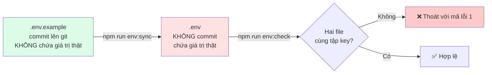
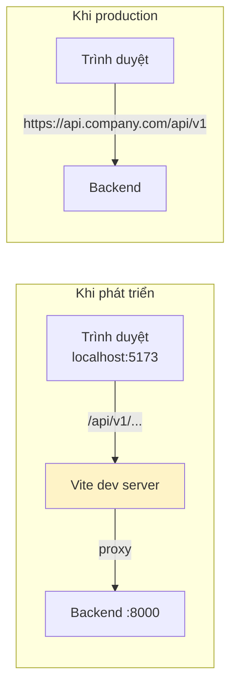

# 06 — Biến môi trường

## Nguyên tắc



- `.env.example` là **tài liệu**: liệt kê mọi biến kèm giải thích. Có trong git.
- `.env` là **cấu hình thật**. `.gitignore` đã chặn.
- `npm run env:sync` tạo `.env` từ example, hoặc **chỉ bổ sung** key còn thiếu — không bao giờ ghi đè giá trị đang có.
- `npm run env:check` báo lỗi nếu hai file lệch nhau. Dùng được trong CI.

## Mức độ quan trọng

| Ký hiệu        | Nghĩa                                             |
| -------------- | ------------------------------------------------- |
| **[BẮT BUỘC]** | Không có thì app **không khởi động được**         |
| **[NÊN CÓ]**   | Có giá trị mặc định, nhưng production nên đặt lại |
| **[TUỲ CHỌN]** | Chỉ cần khi bật tính năng tương ứng               |

## Kiểm tra ngay khi khởi động (fail-fast)

`backend/src/config/env.js` validate toàn bộ biến bằng Zod **trước khi** app chạy:

```
Cau hinh moi truong khong hop le:
  - DB_URI: DB_URI la bat buoc (chuoi ket noi MongoDB)
  - JWT_ACCESS_SECRET: JWT_ACCESS_SECRET phai dai it nhat 32 ky tu

Goi y: chay "npm run env:sync" roi dien .env
```

Sai cấu hình thì biết ngay lúc khởi động, thay vì gặp lỗi mơ hồ lúc 3 giờ sáng.

Có cả **ràng buộc có điều kiện**: bật `GOOGLE_OAUTH_ENABLED=true` mà thiếu `GOOGLE_CLIENT_ID`
thì app từ chối chạy và nói rõ thiếu biến nào.

> **Chuỗi rỗng = chưa cấu hình.** `R2_PUBLIC_URL=` (để trống) được quy về `undefined`
> trước khi validate, nên biến tuỳ chọn để trống không bị báo lỗi oan.

---

# BACKEND — `backend/.env`

## 1. Ứng dụng

| Biến         | Mức độ | Mặc định          | Ghi chú                                                   |
| ------------ | ------ | ----------------- | --------------------------------------------------------- |
| `NODE_ENV`   | NÊN CÓ | `development`     | `development` / `test` / `production`                     |
| `PORT`       | NÊN CÓ | `8000`            | `0` = để hệ điều hành cấp cổng ngẫu nhiên (dùng khi test) |
| `APP_NAME`   | NÊN CÓ | `Source Base API` | Hiện trong log và tiêu đề email                           |
| `API_PREFIX` | NÊN CÓ | `/api/v1`         | Đổi thành `/api/v2` khi lên phiên bản mới                 |
| `LOG_LEVEL`  | NÊN CÓ | `info`            | `debug` khi dev, `info` khi production                    |

`NODE_ENV=production` thay đổi hành vi thật sự: ẩn chi tiết lỗi 500, bật cookie `secure`,
bật `trust proxy`, log dạng JSON một dòng.

## 2. URL công khai

| Biến           | Mức độ                    | Ghi chú                                          |
| -------------- | ------------------------- | ------------------------------------------------ |
| `APP_URL`      | NÊN CÓ                    | URL gốc của backend                              |
| `CLIENT_URL`   | **BẮT BUỘC ở production** | Dùng để chuyển hướng sau OAuth và tạo magic link |
| `CORS_ORIGINS` | **BẮT BUỘC ở production** | Danh sách origin, phân cách bằng dấu phẩy        |

```bash
# Production
CLIENT_URL=https://app.company.com
CORS_ORIGINS=https://app.company.com,https://admin.company.com
```

> Sai `CORS_ORIGINS` là lỗi phổ biến nhất khi deploy: trình duyệt chặn request, console báo
> "blocked by CORS policy". Giá trị phải khớp **chính xác** (kể cả `https://` và cổng).

## 3. Cơ sở dữ liệu

| Biến      | Mức độ       | Ghi chú                       |
| --------- | ------------ | ----------------------------- |
| `DB_URI`  | **BẮT BUỘC** | Chuỗi kết nối MongoDB         |
| `DB_NAME` | TUỲ CHỌN     | Ghi đè tên database trong URI |

**Cách lấy `DB_URI`:**

_Cục bộ:_

```bash
DB_URI=mongodb://127.0.0.1:27017/source_base
```

_MongoDB Atlas (miễn phí):_

1. Vào <https://cloud.mongodb.com> → tạo Cluster (chọn gói M0 Free)
2. **Database Access** → Add New Database User → lưu lại mật khẩu
3. **Network Access** → Add IP Address (dev có thể chọn `0.0.0.0/0`, production phải giới hạn)
4. **Connect** → **Drivers** → sao chép URI → thay `<password>` bằng mật khẩu thật

> ⚠️ Mật khẩu có ký tự đặc biệt (`@ : / ? # [ ]`) phải **URL-encode**.
> Ví dụ `p@ss:word` → `p%40ss%3Aword`. Không làm bước này sẽ gặp lỗi parse URI khó hiểu.

## 4. JWT

| Biến                     | Mức độ       | Mặc định      | Ghi chú                                       |
| ------------------------ | ------------ | ------------- | --------------------------------------------- |
| `JWT_ACCESS_SECRET`      | **BẮT BUỘC** | —             | Tối thiểu 32 ký tự                            |
| `JWT_REFRESH_SECRET`     | **BẮT BUỘC** | —             | Phải **khác** khoá trên (production bắt buộc) |
| `JWT_ACCESS_EXPIRES_IN`  | NÊN CÓ       | `15m`         | Ngắn để giảm thiệt hại khi lộ                 |
| `JWT_REFRESH_EXPIRES_IN` | NÊN CÓ       | `7d`          |                                               |
| `JWT_ISSUER`             | NÊN CÓ       | `source-base` | Phân biệt token giữa các hệ thống             |

**Cách tạo khoá an toàn:**

```bash
node -e "console.log(require('crypto').randomBytes(48).toString('base64url'))"
```

> ⚠️ **Lộ `JWT_ACCESS_SECRET` = kẻ tấn công tự ký được token cho bất kỳ ai, kể cả superAdmin.**
> Không bao giờ commit. Không dùng chung giữa các môi trường. Khi nghi ngờ lộ: đổi ngay
> (mọi phiên hiện tại sẽ bị đăng xuất — đó là điều bạn muốn).

## 5. Cookie

| Biến               | Mức độ   | Mặc định | Ghi chú                                                  |
| ------------------ | -------- | -------- | -------------------------------------------------------- |
| `COOKIE_DOMAIN`    | TUỲ CHỌN | trống    | Đặt `.company.com` khi FE/BE ở subdomain khác nhau       |
| `COOKIE_SAME_SITE` | NÊN CÓ   | `lax`    | `none` khi FE và BE **khác domain** — bắt buộc kèm HTTPS |

## 6. Bảo mật

| Biến                   | Mức độ | Mặc định | Ghi chú                                   |
| ---------------------- | ------ | -------- | ----------------------------------------- |
| `BCRYPT_ROUNDS`        | NÊN CÓ | `10`     | Mỗi +1 làm thời gian băm **tăng gấp đôi** |
| `RATE_LIMIT_WINDOW_MS` | NÊN CÓ | `900000` | 15 phút                                   |
| `RATE_LIMIT_MAX`       | NÊN CÓ | `100`    | Cho toàn API                              |
| `AUTH_RATE_LIMIT_MAX`  | NÊN CÓ | `10`     | Riêng endpoint đăng nhập                  |

Gợi ý `BCRYPT_ROUNDS`: `10` khi dev (nhanh), `12` khi production (an toàn hơn),
`4` khi chạy test (xem `backend/tests/setup.js`).

## 7. Google OAuth

| Biến                   | Mức độ                    |
| ---------------------- | ------------------------- |
| `GOOGLE_OAUTH_ENABLED` | NÊN CÓ (`false` mặc định) |
| `GOOGLE_CLIENT_ID`     | BẮT BUỘC khi bật          |
| `GOOGLE_CLIENT_SECRET` | BẮT BUỘC khi bật          |
| `GOOGLE_CALLBACK_URL`  | BẮT BUỘC khi bật          |

**Cách tạo:**

1. Vào <https://console.cloud.google.com> → tạo Project mới
2. **APIs & Services** → **OAuth consent screen** → chọn _External_ → điền tên app, email hỗ trợ
3. **APIs & Services** → **Credentials** → **Create Credentials** → **OAuth client ID**
4. _Application type_: **Web application**
5. _Authorized redirect URIs_: dán **chính xác** giá trị `GOOGLE_CALLBACK_URL`

```
http://localhost:8000/api/v1/auth/google/callback
```

> ⚠️ URI phải khớp **từng ký tự** với cấu hình trên Google Console (kể cả dấu `/` cuối).
> Sai một ký tự → lỗi `redirect_uri_mismatch`.

Nhớ đặt `VITE_ENABLE_GOOGLE_LOGIN=true` ở frontend cho khớp.

## 8. Magic link

| Biến                       | Mức độ | Mặc định                    |
| -------------------------- | ------ | --------------------------- |
| `MAGIC_LINK_ENABLED`       | NÊN CÓ | `true`                      |
| `MAGIC_LINK_EXPIRES_IN`    | NÊN CÓ | `15m`                       |
| `MAGIC_LINK_REDIRECT_PATH` | NÊN CÓ | `/auth/magic-link/callback` |

Link đầy đủ = `CLIENT_URL` + `MAGIC_LINK_REDIRECT_PATH` + `?token=...`

## 9. Email (Phase 2)

| Biến             | Mức độ                            | Ghi chú                       |
| ---------------- | --------------------------------- | ----------------------------- |
| `MAIL_DRIVER`    | NÊN CÓ                            | `console` / `smtp` / `resend` |
| `MAIL_FROM`      | NÊN CÓ                            | Địa chỉ người gửi hiển thị    |
| `SMTP_*`         | BẮT BUỘC khi `MAIL_DRIVER=smtp`   |                               |
| `RESEND_API_KEY` | BẮT BUỘC khi `MAIL_DRIVER=resend` |                               |

`MAIL_DRIVER=console` in nội dung email ra log — đủ để phát triển magic link mà không cần cấu hình gì.

**Dùng Gmail SMTP:** bật xác thực 2 bước → tạo _App password_ tại
<https://myaccount.google.com/apppasswords> → dùng mật khẩu đó cho `SMTP_PASSWORD`.

```bash
SMTP_HOST=smtp.gmail.com
SMTP_PORT=587
```

## 10. Cache (Phase 3)

| Biến                | Mức độ                            | Ghi chú                                            |
| ------------------- | --------------------------------- | -------------------------------------------------- |
| `CACHE_DRIVER`      | NÊN CÓ                            | `memory` (một instance) / `redis` (nhiều instance) |
| `REDIS_URL`         | BẮT BUỘC khi `CACHE_DRIVER=redis` | `redis://127.0.0.1:6379`                           |
| `CACHE_TTL_SECONDS` | NÊN CÓ                            | `300`                                              |

Redis miễn phí: <https://console.upstash.com>

## 11. Lưu trữ file — Cloudflare R2 (Phase 4)

| Biến                   | Mức độ                           |
| ---------------------- | -------------------------------- |
| `STORAGE_DRIVER`       | NÊN CÓ (`local` / `r2`)          |
| `R2_ACCOUNT_ID`        | BẮT BUỘC khi `STORAGE_DRIVER=r2` |
| `R2_ACCESS_KEY_ID`     | BẮT BUỘC khi dùng R2             |
| `R2_SECRET_ACCESS_KEY` | BẮT BUỘC khi dùng R2             |
| `R2_BUCKET`            | BẮT BUỘC khi dùng R2             |
| `R2_PUBLIC_URL`        | TUỲ CHỌN                         |
| `MAX_UPLOAD_SIZE_MB`   | NÊN CÓ (`5`)                     |

**Cách lấy:**

1. <https://dash.cloudflare.com> → **R2** → **Create bucket**
2. **R2** → **Manage R2 API Tokens** → **Create API Token** → quyền _Object Read & Write_
3. `R2_ACCOUNT_ID` nằm ở góc phải trang tổng quan R2
4. Muốn file truy cập công khai: bật _Public Access_ hoặc gắn custom domain → điền `R2_PUBLIC_URL`

## 12. Cron jobs (Phase 5)

| Biến            | Mức độ | Mặc định           |
| --------------- | ------ | ------------------ |
| `CRON_ENABLED`  | NÊN CÓ | `false`            |
| `CRON_TIMEZONE` | NÊN CÓ | `Asia/Ho_Chi_Minh` |

> ⚠️ Chạy nhiều instance thì **chỉ bật trên một instance**, nếu không mỗi tác vụ sẽ chạy nhiều lần.

## 13. Tài khoản khởi tạo

| Biến                        | Mức độ | Mặc định                 |
| --------------------------- | ------ | ------------------------ |
| `SEED_SUPER_ADMIN_EMAIL`    | NÊN CÓ | `superadmin@example.com` |
| `SEED_SUPER_ADMIN_PASSWORD` | NÊN CÓ | `SuperAdmin@123`         |

> ⚠️ **Bắt buộc đổi trước khi lên production.**

---

# FRONTEND — `frontend/.env`

> ⚠️ **Mọi biến `VITE_*` đều CÔNG KHAI.** Chúng được nhúng thẳng vào file JavaScript gửi về
> trình duyệt — bất kỳ ai cũng xem được trong DevTools. **Tuyệt đối không đặt secret ở đây.**

| Biến                         | Mức độ   | Mặc định                | Ghi chú                            |
| ---------------------------- | -------- | ----------------------- | ---------------------------------- |
| `VITE_API_BASE_URL`          | NÊN CÓ   | `/api/v1`               | Để tương đối khi dev để Vite proxy |
| `VITE_PROXY_TARGET`          | NÊN CÓ   | `http://localhost:8000` | Chỉ có tác dụng khi dev            |
| `VITE_API_TIMEOUT`           | NÊN CÓ   | `15000`                 | Mili giây                          |
| `VITE_APP_NAME`              | NÊN CÓ   | `Source Base`           |                                    |
| `VITE_ENABLE_QUERY_DEVTOOLS` | TUỲ CHỌN | `true`                  | Chỉ bật khi dev                    |
| `VITE_ENABLE_GOOGLE_LOGIN`   | NÊN CÓ   | `false`                 | Phải khớp `GOOGLE_OAUTH_ENABLED`   |
| `VITE_ENABLE_MAGIC_LINK`     | NÊN CÓ   | `true`                  | Phải khớp `MAGIC_LINK_ENABLED`     |

## Vì sao `VITE_API_BASE_URL` mặc định là đường dẫn tương đối?



Khi dev, Vite proxy `/api` sang backend. Trình duyệt coi như **cùng origin** → cookie `httpOnly`
gửi bình thường, không vướng CORS. Khi deploy khác domain thì điền URL đầy đủ và cấu hình
`CORS_ORIGINS` + `COOKIE_SAME_SITE=none` ở backend.

## Các biến cần khớp giữa hai bên

| Frontend                   | Backend                | Hậu quả nếu lệch                     |
| -------------------------- | ---------------------- | ------------------------------------ |
| `VITE_ENABLE_GOOGLE_LOGIN` | `GOOGLE_OAUTH_ENABLED` | Hiện nút Google, bấm vào báo lỗi 400 |
| `VITE_ENABLE_MAGIC_LINK`   | `MAGIC_LINK_ENABLED`   | Hiện form magic link, gửi thì lỗi    |
| `VITE_PROXY_TARGET`        | `PORT`                 | Dev không gọi được API               |
| `VITE_API_BASE_URL`        | `API_PREFIX`           | Mọi request 404                      |
