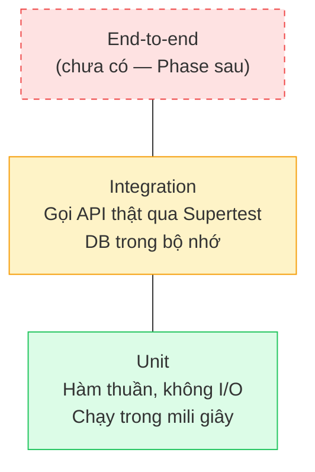
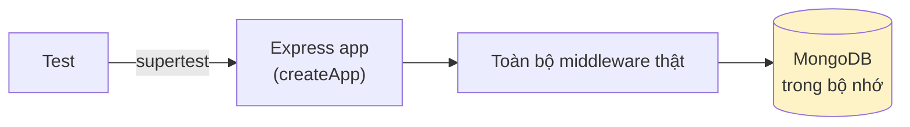

# 07 — Kiểm thử

## Tình trạng hiện tại

| Nơi                   | Số test | Công cụ                                    |
| --------------------- | ------: | ------------------------------------------ |
| Backend — unit        |     133 | Vitest                                     |
| Backend — integration |      91 | Vitest + Supertest + mongodb-memory-server |
| Frontend              |      98 | Vitest + Testing Library + jsdom           |
| **Tổng**              | **322** |                                            |

```bash
npm test           # chạy tất cả
npm run test:be    # chỉ backend
npm run test:fe    # chỉ frontend
npm run test:cov   # kèm báo cáo độ phủ
```

## Chiến lược: kim tự tháp test



Càng lên cao: chậm hơn, giòn hơn, nhưng giống thực tế hơn. Nguyên tắc: **nhiều unit, vừa đủ
integration, ít e2e**.

## Backend — Unit test

Kiểm thử phần logic thuần, không chạm DB hay HTTP.

**Phạm vi:** ma trận RBAC, `AppError`, `queryFeatures`, JWT, băm mật khẩu, crypto, thời gian,
slug, validate env, schema Zod, các middleware, `AuthService` (với dependency giả lập).

```js
// tests/unit/roles.test.js
it("quyền của vai trò thấp là tập con của vai trò cao", () => {
  const member = getPermissionsOfRole(ROLES.MEMBER);
  const admin = getPermissionsOfRole(ROLES.ADMIN);
  expect(admin).toEqual(expect.arrayContaining([...member]));
});
```

### Test service mà không cần DB

`AuthService` nhận dependency qua constructor, nên test giả lập được toàn bộ:

```js
// tests/unit/authService.test.js
const { service, google, users } = buildService();

google.exchangeCodeForProfile.mockResolvedValue({
  providerId: "google-sub-123",
  email: "newbie@example.com",
});

const session = await service.loginWithGoogle({ code: "code-tu-google" });
expect(session.isNewUser).toBe(true);
```

Nhờ vậy kiểm được **toàn bộ luồng Google OAuth** mà không gọi Google thật, không cần mạng.

## Backend — Integration test

Gọi API thật qua Supertest, dùng MongoDB chạy hoàn toàn trong bộ nhớ.



```js
// tests/integration/auth.test.js
describe("Xac thuc", () => {
  beforeAll(async () => {
    await startTestDatabase();
    client = createClient();
  });
  afterEach(async () => clearDatabase()); // mỗi test bắt đầu với DB sạch
  afterAll(async () => stopTestDatabase());

  it("sai mật khẩu và email không tồn tại trả về CÙNG một thông báo", async () => {
    const user = await createUser();

    const wrongPassword = await client
      .post(`${API}/auth/login`)
      .send({ email: user.email, password: "SaiMatKhau123" })
      .expect(401);
    const noSuchEmail = await client
      .post(`${API}/auth/login`)
      .send({ email: "khongcoai@example.com", password: TEST_PASSWORD })
      .expect(401);

    expect(wrongPassword.body.message).toBe(noSuchEmail.body.message);
  });
});
```

### `mongodb-memory-server`

Tải MongoDB thật về (lần đầu ~66 MB, sau đó dùng bản đã cache) rồi chạy trong RAM. Ưu điểm:

- Không cần cài MongoDB trên máy dev hay máy CI.
- Không để lại dữ liệu rác.
- Test chạy song song không giẫm lên nhau.

Vitest cấu hình `singleFork: true` để mọi file test dùng chung một kết nối Mongoose.

### Những gì integration test bảo vệ

| Nhóm                | Ví dụ kiểm tra                                                                  |
| ------------------- | ------------------------------------------------------------------------------- |
| Xác thực            | Mật khẩu không bao giờ lọt vào response; cookie phải là `httpOnly`              |
| Chống dò tài khoản  | Hai loại lỗi đăng nhập trả về cùng thông báo                                    |
| Magic link          | Token lưu dạng hash; chỉ dùng được một lần                                      |
| Token rotation      | Dùng lại refresh token cũ → 401                                                 |
| RBAC                | Bảng vai trò × endpoint → mã trạng thái mong đợi                                |
| Leo thang đặc quyền | `PATCH /users/me` gửi kèm `role` → bị bỏ qua                                    |
| Phân trang          | `meta.pagination` đúng ở trang đầu/giữa/cuối                                    |
| Định dạng           | Mọi response đều có `success`/`message`/`data`; model trả `id` không phải `_id` |

Ví dụ test RBAC theo bảng:

```js
it.each([
  [ROLES.MEMBER, 403],
  [ROLES.ADMIN, 200],
  [ROLES.SUPER_ADMIN, 200],
])("vai tro %s -> %i", async (role, expectedStatus) => {
  const { accessToken } = await createUserAndLogin(client, { role });
  await client.get(`${API}/users`).set(auth(accessToken)).expect(expectedStatus);
});
```

## Frontend — Test

Triết lý của Testing Library: **test theo cách người dùng nhìn thấy**, không test chi tiết cài đặt.

```js
// ❌ Test chi tiết cài đặt — hỏng ngay khi đổi class CSS
expect(wrapper.find(".btn-primary").prop("disabled")).toBe(true);

// ✅ Test theo góc nhìn người dùng
expect(screen.getByRole("button", { name: "Dang nhap" })).toBeDisabled();
```

### Phạm vi

| Nhóm          | File                           | Kiểm gì                                            |
| ------------- | ------------------------------ | -------------------------------------------------- |
| Chuẩn hoá lỗi | `apiError.test.js`             | Dịch lỗi axios → `ApiError`; `toFormErrors()`      |
| Lưu token     | `tokenStorage.test.js`         | **Không** ghi vào `localStorage`                   |
| Định dạng     | `format.test.js`               | Tiền tệ, ngày tháng theo chuẩn Việt Nam            |
| Quyền         | `useAuth.test.jsx`             | Ma trận vai trò × quyền                            |
| Hook          | `useDebounce`, `useDisclosure` | Hành vi theo thời gian                             |
| Sinh CRUD     | `createCrudHooks.test.jsx`     | Bóc tách dữ liệu, invalidate cache                 |
| Chặn đường    | `guards.test.jsx`              | Chuyển hướng đúng theo quyền                       |
| Component     | `Button`, `FormField`          | Trạng thái loading, thuộc tính trợ năng            |
| Schema        | `auth.schemas.test.js`         | Quy tắc khớp với backend                           |
| Trang         | `LoginPage.test.jsx`           | Luồng đầy đủ: nhập → validate → gọi API → hiện lỗi |

### Test guard bằng router thật

Dùng `createMemoryRouter` để kiểm được cả việc **chuyển hướng**, không chỉ nội dung hiện ra:

```js
it("thiếu quyền → chuyển sang trang 403", () => {
  renderGuard(<RequirePermission permissions={[PERMISSIONS.USER_READ]} />, {
    auth: { user: mockUsers.member },
  });
  expect(screen.getByText("TRANG 403")).toBeInTheDocument();
});
```

### Test trang có gọi API

Giả lập ở tầng **API module**, không giả lập axios — test vẫn đi qua toàn bộ hook và form thật:

```js
vi.mock("../auth.api.js", () => ({
  authApi: { login: vi.fn(), requestMagicLink: vi.fn(), getGoogleAuthUrl: vi.fn() },
}));

it("lỗi validate của backend được gắn vào đúng ô nhập", async () => {
  authApi.login.mockRejectedValue(
    new ApiError({
      status: 422,
      errorCode: "VALIDATION_ERROR",
      details: [{ field: "body.email", message: "Email nay da bi chan" }],
    }),
  );

  // ...điền form, bấm gửi...
  expect(await screen.findByText("Email nay da bi chan")).toBeInTheDocument();
});
```

### Công cụ dùng chung: `src/test/utils.jsx`

```js
renderWithProviders(<LoginPage />, { auth: { user: mockUsers.admin } });
```

Tự bọc `QueryClientProvider` + `ToastProvider` + `AuthContext` + router. `mockUsers` có sẵn ba
vai trò kèm danh sách quyền tương ứng.

## Viết test cho module mới

### Backend

```js
// tests/integration/article.test.js
import { afterAll, afterEach, beforeAll, describe, expect, it } from "vitest";
import { clearDatabase, startTestDatabase, stopTestDatabase } from "../helpers/db.js";
import { API, auth, createClient, createUserAndLogin } from "../helpers/app.js";
import { ROLES } from "../../src/core/constants/roles.js";

describe("Module bai viet", () => {
  let client, admin, member;

  beforeAll(async () => {
    await startTestDatabase();
    client = createClient();
  });
  afterEach(async () => clearDatabase());
  afterAll(async () => stopTestDatabase());

  beforeEach(async () => {
    admin = await createUserAndLogin(client, { role: ROLES.ADMIN });
    member = await createUserAndLogin(client, { role: ROLES.MEMBER });
  });

  it("member khong duoc tao bai viet", async () => {
    await client
      .post(`${API}/articles`)
      .set(auth(member.accessToken))
      .send({ title: "Bai viet", content: "Noi dung du dai" })
      .expect(403);
  });
});
```

### Frontend

```js
// features/articles/useArticles.test.jsx
import { renderHook, waitFor } from "@testing-library/react";
import { createHookWrapper } from "@/test/utils.jsx";

vi.mock("./articles.api.js", () => ({ articlesApi: { list: vi.fn() } }));
```

## Danh sách cần kiểm khi thêm endpoint mới

- [ ] Đường đi thành công (2xx)
- [ ] Dữ liệu sai → 422 kèm `details` đúng trường
- [ ] Chưa đăng nhập → 401
- [ ] Thiếu quyền → 403 (kiểm **từng** vai trò)
- [ ] Bản ghi không tồn tại → 404
- [ ] ID sai định dạng → 422
- [ ] Không rò rỉ dữ liệu nhạy cảm (mật khẩu, hash token)
- [ ] Trường không được phép trong body bị bỏ qua (chống leo thang đặc quyền)

## Lưu ý khi viết test

| Nên                                        | Không nên                              |
| ------------------------------------------ | -------------------------------------- |
| `afterEach(clearDatabase)` để test độc lập | Để test này phụ thuộc dữ liệu test kia |
| `it.each` cho ma trận vai trò/trạng thái   | Viết lặp 3 lần gần giống nhau          |
| `findByText` (async) khi chờ dữ liệu về    | `getByText` ngay sau khi bấm nút       |
| Đặt tên test mô tả **hành vi**             | "test 1", "should work"                |
| Giả lập ở ranh giới (lớp API, strategy)    | Giả lập nội bộ của hàm đang test       |
| `BCRYPT_ROUNDS=4` khi test                 | Dùng 10–12 (test chậm gấp nhiều lần)   |
