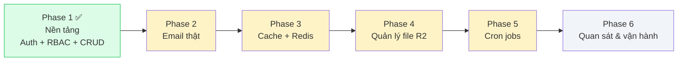
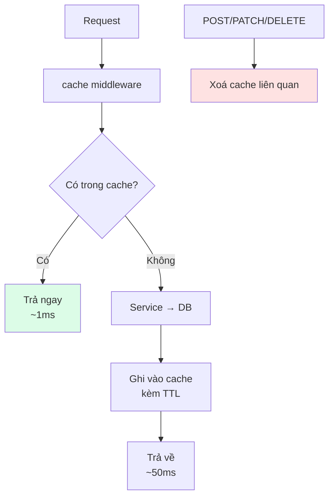
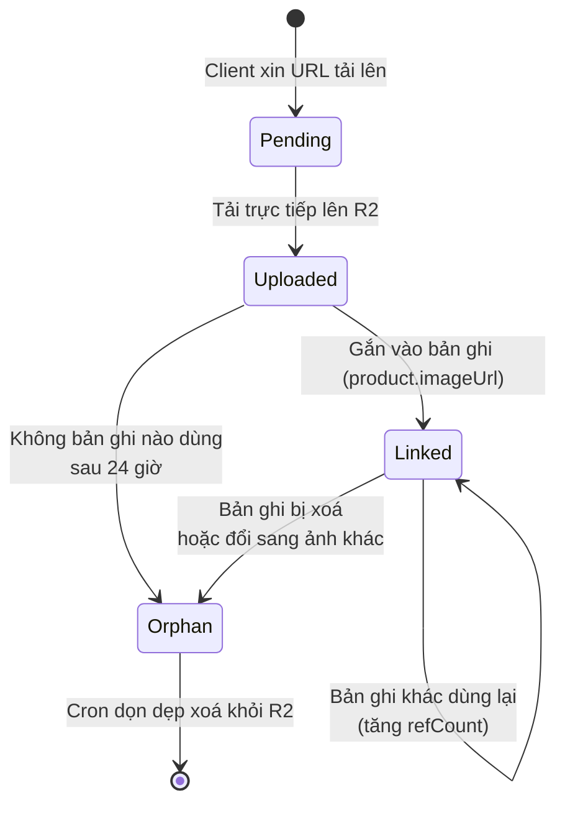
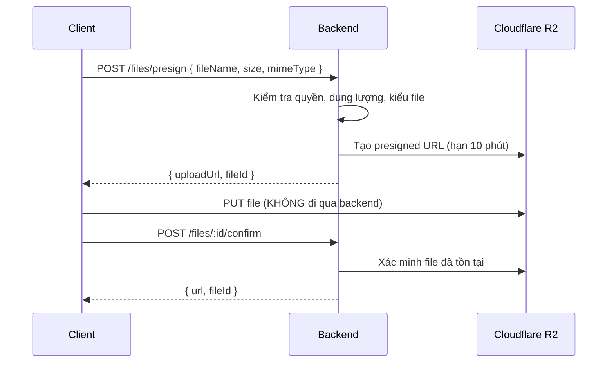

# 09 — Lộ trình phát triển

## Tổng quan các phase



Mỗi phase đã có **sẵn chỗ cắm** trong code hiện tại: biến môi trường đã khai báo và validate,
điểm mở rộng đã được thiết kế. Xem [CHECK_LIST.md](../CHECK_LIST.md) để theo dõi tiến độ.

---

## Phase 1 — Nền tảng ✅ Hoàn thành

Xác thực 3 phương thức, RBAC 3 vai trò, kiến trúc module, xử lý lỗi tập trung, 322 test.
Chi tiết xem [CHECK_LIST.md](../CHECK_LIST.md).

---

## Phase 2 — Email thật

### Mục tiêu

Thay driver `console` bằng SMTP hoặc Resend; thêm hàng đợi để gửi mail không chặn request.

### Chỗ cắm đã có sẵn

`backend/src/shared/services/mail.service.js` được thiết kế theo mẫu **driver**:

```js
const DRIVERS = {
  console: consoleDriver,
  smtp: createUnimplementedDriver("smtp"), // ← Phase 2 thay tại đây
  resend: createUnimplementedDriver("resend"), // ← Phase 2 thay tại đây
};
```

Code nghiệp vụ gọi `mailService.sendMagicLink(...)` **không cần sửa một dòng nào**.

### Việc cần làm

- [ ] Cài `nodemailer`, hiện thực `smtpDriver`
- [ ] Hiện thực `resendDriver` (gọi REST API của Resend)
- [ ] Tách template mail ra file riêng (`shared/mail-templates/`)
- [ ] Thêm hàng đợi nhẹ để retry khi gửi thất bại
- [ ] Bổ sung luồng: xác minh email khi đăng ký, quên mật khẩu
- [ ] Test: giả lập driver, kiểm nội dung mail và cơ chế retry

### Biến môi trường (đã khai báo sẵn)

`MAIL_DRIVER`, `MAIL_FROM`, `SMTP_HOST`, `SMTP_PORT`, `SMTP_USER`, `SMTP_PASSWORD`, `RESEND_API_KEY`

---

## Phase 3 — Cache & Redis

### Mục tiêu

Giảm tải cho MongoDB; cho phép chạy nhiều instance mà rate limit vẫn đúng.



### Việc cần làm

- [ ] `core/cache/CacheService.js` với hai driver: `memory` và `redis`
- [ ] `core/middlewares/cache.js` — cache response theo đường dẫn + query
- [ ] Tự xoá cache khi có thao tác ghi (tương tự `invalidateQueries` ở frontend)
- [ ] Chuyển store của rate limit sang Redis
- [ ] Thêm cache cho các truy vấn nặng (đếm tổng, tổng hợp)
- [ ] Test: kiểm hit/miss, TTL, và việc xoá cache sau khi ghi

### Điểm cần lưu ý

> Cache là một trong hai vấn đề khó nhất của ngành. Quy tắc an toàn:
> **chỉ cache dữ liệu đọc nhiều, ghi ít, và chấp nhận được độ trễ vài phút.**
> Không bao giờ cache dữ liệu riêng tư mà không kèm định danh người dùng vào khoá cache.

### Biến môi trường (đã khai báo sẵn)

`CACHE_DRIVER`, `REDIS_URL`, `CACHE_TTL_SECONDS`

---

## Phase 4 — Quản lý file với Cloudflare R2

### Mục tiêu

Tải file lên, dùng lại file đã có, và **dọn file mồ côi** (orphan file — file không còn bản ghi
nào tham chiếu tới).

### Vòng đời một file



### Thiết kế dự kiến

```js
// modules/file/file.model.js
{
  key: "uploads/2026/03/abc123.webp",  // đường dẫn trong bucket
  originalName: "anh-san-pham.jpg",
  mimeType: "image/webp",
  size: 245678,
  checksum: "sha256:...",              // để phát hiện file trùng → DÙNG LẠI
  uploadedBy: ObjectId,
  refCount: 0,                          // số bản ghi đang tham chiếu
  status: "pending" | "linked" | "orphan",
  linkedAt: Date,
}
```

### Việc cần làm

- [ ] `core/storage/StorageService.js` với hai driver: `local` và `r2` (dùng SDK tương thích S3)
- [ ] Module `file`: model, service, route
- [ ] **Presigned URL**: client tải thẳng lên R2, không đi qua server
- [ ] **Dùng lại file**: cùng `checksum` → trả file cũ thay vì tải lên bản sao
- [ ] Đếm tham chiếu: `linkFile()` / `unlinkFile()` khi bản ghi thay đổi
- [ ] Cron dọn file mồ côi (phối hợp với Phase 5)
- [ ] Kiểm tra kiểu MIME thật (đọc magic bytes, không tin phần mở rộng)
- [ ] Giới hạn dung lượng theo `MAX_UPLOAD_SIZE_MB`
- [ ] Test: tải lên, dùng lại, nhận diện mồ côi, dọn dẹp

### Vì sao dùng presigned URL?



File lớn không chiếm băng thông và bộ nhớ của server — quan trọng khi chạy trên máy chủ nhỏ.

### Biến môi trường (đã khai báo sẵn)

`STORAGE_DRIVER`, `R2_ACCOUNT_ID`, `R2_ACCESS_KEY_ID`, `R2_SECRET_ACCESS_KEY`, `R2_BUCKET`,
`R2_PUBLIC_URL`, `MAX_UPLOAD_SIZE_MB`

---

## Phase 5 — Cron jobs

### Mục tiêu

Chạy các tác vụ định kỳ một cách an toàn khi có nhiều instance.

### Các job dự kiến

| Job                      | Lịch            | Nhiệm vụ                                  |
| ------------------------ | --------------- | ----------------------------------------- |
| `cleanup-orphan-files`   | 03:00 hằng ngày | Xoá file mồ côi trên R2 (Phase 4)         |
| `cleanup-expired-tokens` | 04:00 hằng ngày | Dọn token hết hạn (bổ sung cho TTL index) |
| `send-digest-email`      | Thứ hai 08:00   | Gửi email tổng hợp (Phase 2)              |
| `refresh-statistics`     | Mỗi giờ         | Tính trước số liệu thống kê nặng          |

### Thiết kế dự kiến

```js
// core/cron/CronService.js
cronService.register({
  name: "cleanup-orphan-files",
  schedule: "0 3 * * *",
  timezone: env.CRON_TIMEZONE,
  handler: async () => { ... },
  runOnlyOnce: true,  // dùng khoá phân tán để nhiều instance không chạy trùng
});
```

### Việc cần làm

- [ ] `core/cron/CronService.js` (dùng `node-cron` hoặc `croner`)
- [ ] Khoá phân tán qua Redis để chỉ một instance chạy mỗi job
- [ ] Ghi lịch sử chạy job (thành công/thất bại/thời lượng) vào DB
- [ ] Trang quản trị xem lịch sử và chạy thủ công
- [ ] Cảnh báo khi job thất bại
- [ ] Test: chạy handler trực tiếp (không chờ tới giờ)

### Điểm cần lưu ý

> ⚠️ Chạy nhiều instance mà không có khoá phân tán thì mỗi job chạy N lần.
> Với job gửi email, người dùng sẽ nhận N bản sao.
> Giải pháp tạm thời khi chưa có Redis: bật `CRON_ENABLED=true` trên **đúng một** instance.

### Biến môi trường (đã khai báo sẵn)

`CRON_ENABLED`, `CRON_TIMEZONE`

---

## Phase 6 — Quan sát & vận hành

### Việc cần làm

- [ ] Ghi log có cấu trúc, gửi sang dịch vụ tập trung (Datadog / CloudWatch / Loki)
- [ ] Theo dõi lỗi bằng Sentry (cả frontend và backend)
- [ ] Health check nâng cao: kiểm tra cả DB, Redis, R2
- [ ] Sinh tài liệu API tự động (OpenAPI từ schema Zod)
- [ ] CI/CD: chạy `npm run check` trên mỗi pull request
- [ ] Docker + docker-compose cho môi trường phát triển
- [ ] Test end-to-end bằng Playwright
- [ ] Đo hiệu năng và đặt ngân sách hiệu năng (performance budget)

---

## Nguyên tắc khi mở rộng

| Nguyên tắc                         | Ý nghĩa                                                                  |
| ---------------------------------- | ------------------------------------------------------------------------ |
| **Thêm driver, không sửa lời gọi** | Phase 2/3/4 đều theo mẫu driver — code nghiệp vụ không đổi               |
| **Biến môi trường khai báo trước** | Biến của mọi phase đã có trong `.env.example` và được validate           |
| **Ràng buộc có điều kiện**         | Bật tính năng mà thiếu cấu hình → app báo lỗi rõ ràng ngay khi khởi động |
| **Mặc định an toàn**               | Tính năng chưa hoàn thiện mặc định **tắt** (`CRON_ENABLED=false`)        |
| **Test trước khi đánh dấu xong**   | Một mục trong CHECK_LIST chỉ được tick khi đã có test bảo vệ             |
